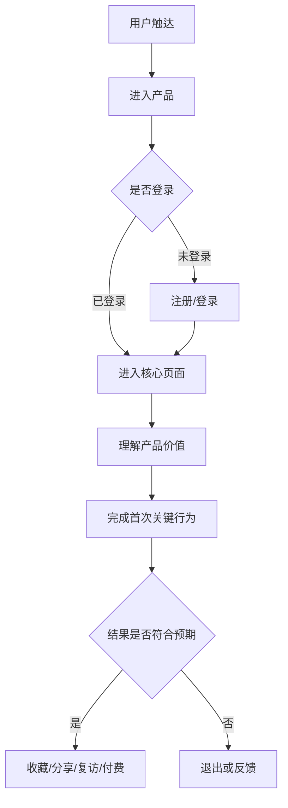
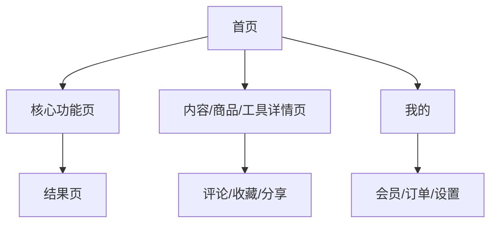
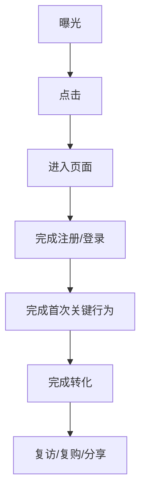
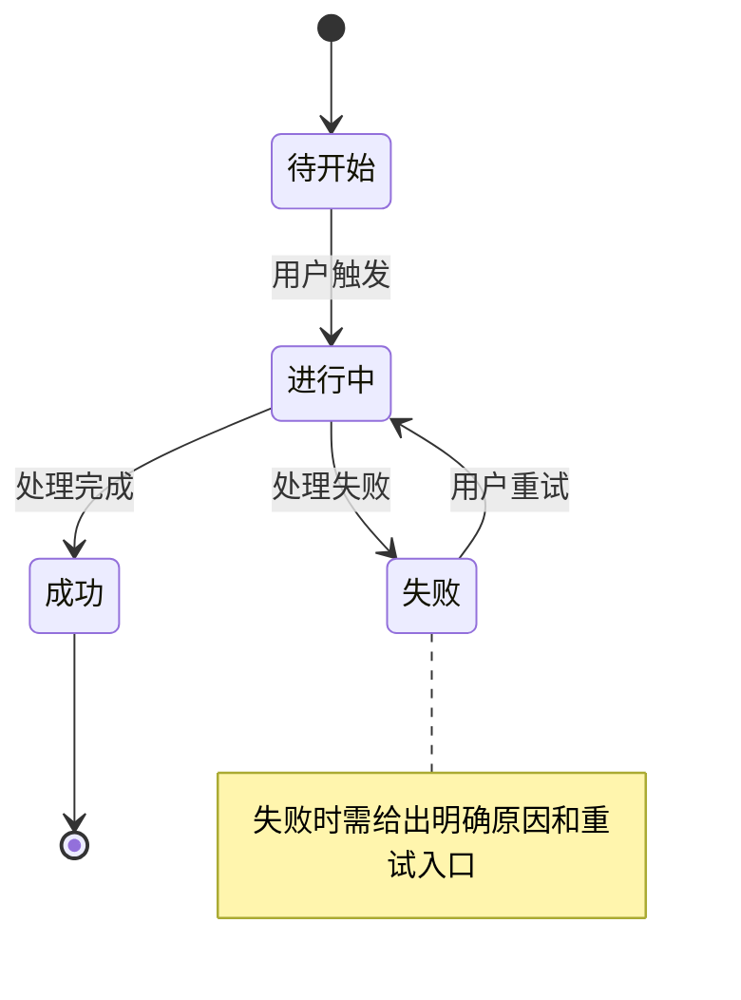
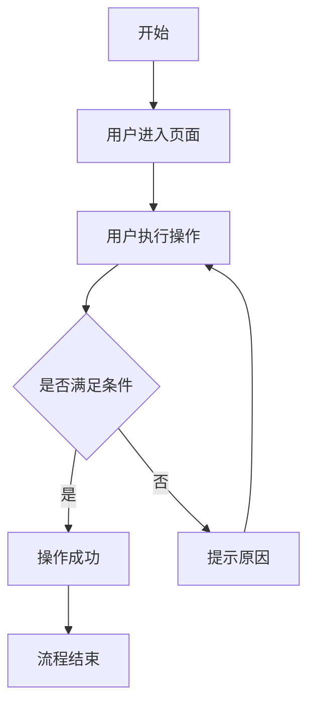

# Create-CPRD 完整独立 Prompt

> 本文件是 create-cprd 技能的完整独立版本，可在任何 LLM 中直接使用。
> 将本文件内容粘贴到 ChatGPT / Gemini / DeepSeek / Claude 等 LLM 中，然后提供您的产品想法、用户场景、业务背景、竞品资料或需求描述，即可生成结构化 C 端产品 PRD。

---

## SKILL

# create-cprd

根据用户提供的产品想法、用户场景、业务目标、竞品资料、增长需求或功能描述，生成结构化的、带有初始内容的 C 端产品 PRD 文档。

支持显式调用，如 `/create-cprd`，也支持自动触发。当用户明确要求创建、撰写 C 端 PRD、App 需求文档、小程序需求文档、用户产品方案、增长实验方案、活动需求文档或消费级产品设计方案时，自动触发本技能。

---

## 输入

用户可以提供以下任意形式的输入：

- 产品想法
- 用户需求描述
- 业务背景
- 竞品链接或竞品截图
- 用户反馈
- 数据指标问题
- 增长目标
- 活动策划描述
- App / 小程序 / H5 / Web 功能需求
- 会议纪要
- 简要产品方向
- 或通过 `$ARGUMENTS` 传入的文件路径

如有参数传入，优先作为输入源：

$ARGUMENTS

---

# 生成流程

严格按以下顺序执行，不可跳过或调换步骤。

---

## 阶段 0：理解上下文与产品定型

### 0.1 完整理解上下文

1. 完整阅读用户提供的全部产品背景、需求描述、截图、竞品信息或会议纪要。
2. 从用户描述中识别：
   - 这是一个新产品，还是已有产品的功能迭代；
   - 面向什么用户；
   - 用户在什么场景下使用；
   - 用户当前有什么痛点；
   - 产品希望改变什么用户行为；
   - 本次 PRD 更偏功能设计、增长实验、商业化转化，还是活动运营。

---

### 0.2 产品阶段判断

从以下类型中选择最贴近的一种或多种：

| 产品阶段 | 定义 | PRD 侧重点 |
| --- | --- | --- |
| 0-1 新产品 | 从零设计一个新的 C 端产品 | 用户价值、核心场景、MVP、冷启动、核心路径 |
| 功能迭代 | 在已有产品中新增或优化某个功能 | 现有问题、影响范围、用户路径变化、兼容性 |
| 增长实验 | 为拉新、激活、留存、转化设计功能或策略 | 指标假设、实验分组、转化漏斗、A/B 测试 |
| 活动需求 | 节日活动、营销活动、运营活动 | 活动规则、参与路径、奖励机制、风控 |
| 商业化需求 | 会员、订阅、付费内容、交易转化等 | 付费权益、转化路径、价格策略、续费和流失 |
| 体验优化 | 优化页面、流程、交互、性能或视觉体验 | 用户旅程、流失点、交互反馈、异常状态 |

---

### 0.3 产品形态判断

从以下类型中选择最贴近的一种或多种：

| C端产品形态 | 特征 | 设计侧重 |
| --- | --- | --- |
| 工具效率型 | 帮用户完成明确任务 | 低学习成本、任务完成率、使用效率、复访 |
| 内容消费型 | 用户浏览、观看、阅读、收藏、分享内容 | 内容供给、推荐分发、消费深度、互动 |
| 社区社交型 | 用户发布、关注、评论、私信、建立关系链 | 用户身份、关系链、互动氛围、内容治理 |
| 交易电商型 | 商品浏览、下单、支付、履约、售后 | 商品、订单、支付、转化、复购、售后 |
| 本地生活型 | 基于位置、门店、预约、核销、评价 | 地理位置、门店服务、预约履约、评价体系 |
| 会员订阅型 | 用户购买会员或订阅权益 | 权益设计、付费墙、续费、召回 |
| 游戏激励型 | 通过任务、积分、等级、奖励驱动行为 | 成长体系、任务体系、激励闭环、防作弊 |
| AI工具型 | 用户通过 AI 完成生成、问答、陪伴或辅助任务 | 输入输出、人机边界、生成质量、反馈优化 |
| 硬件联动型 | App 与智能硬件、设备或终端联动 | 设备绑定、状态同步、远程控制、异常提醒 |

---

### 0.4 商业模式判断

从以下模式中选择最贴近的一种或多种：

| 商业模式 | 定义 | PRD 侧重点 |
| --- | --- | --- |
| 免费增长型 | 先追求用户规模和活跃 | 拉新、激活、留存、分享 |
| 广告变现型 | 通过流量和广告位变现 | 流量、时长、广告曝光、体验平衡 |
| 会员订阅型 | 通过月费、年费或连续订阅变现 | 权益、试用、付费转化、续费、流失 |
| 交易佣金型 | 通过交易抽佣或服务费变现 | 订单、GMV、转化率、履约、售后 |
| 增值服务型 | 基础功能免费，高级功能收费 | 免费/付费边界、功能锁定、升级引导 |
| 内容付费型 | 用户为课程、文章、视频、资料等付费 | 内容价值、试看、购买转化、复购 |
| 混合变现型 | 同时包含广告、会员、交易、增值服务等 | 多目标平衡，避免商业化破坏体验 |

---

### 0.5 用户生命周期判断

判断本次需求主要影响哪个阶段：

| 用户阶段 | 典型问题 | PRD 重点 |
| --- | --- | --- |
| 未触达用户 | 用户还不知道产品 | 渠道、落地页、传播点 |
| 新访客 | 用户第一次进入产品 | 首屏价值、新手引导、注册转化 |
| 新注册用户 | 用户刚注册但未形成习惯 | 激活路径、首次关键行为 |
| 活跃用户 | 用户已有持续使用行为 | 效率提升、体验优化、深度使用 |
| 沉默用户 | 用户曾使用但近期不活跃 | 召回、权益提醒、内容触达 |
| 付费用户 | 用户已经付费 | 权益感知、续费、增购 |
| 流失用户 | 用户停止使用或取消付费 | 流失原因、召回策略、替代方案 |

---

### 0.6 向用户呈现定型结果并请求确认

用一句话向用户呈现推断结果：

> 根据您的描述，这是一个【{产品阶段} × {产品形态} × {商业模式}】的 C 端产品需求，主要影响【{用户生命周期阶段}】用户，核心目标是【{希望改变的用户行为或业务指标}】。我会据此调整 PRD 各章节的侧重点。如有不对请纠正。

等待用户确认后再继续。

如用户明确要求直接生成，且上下文足够清晰，可以先基于当前判断生成初稿，并在文档开头标注：

> 当前产品定型为初步判断，后续可根据业务方反馈调整。

---

# 阶段 1：前置章节，第1-9章

按顺序生成第1至第9章。每完成一章，立即输出该章内容，不要等所有章节完成后再一起输出。

前置章节包括：

1. 第1章 产品背景
2. 第2章 用户与需求基本情况
3. 第3章 市场、竞品与增长机会
4. 第4章 产品目标与指标
5. 第5章 产品方案概述与 MVP
6. 第6章 项目范围
7. 第7章 风险与约束
8. 第8章 术语和缩略语
9. 第9章 参考文献和引用文档

---

# 阶段 2：核心功能需求，第10章

第10章是 C 端 PRD 中最核心的章节。按以下子章节分段生成：

- 10.1 产品体验框架
- 10.2 核心用户路径
- 10.3 页面与功能清单
- 10.4 核心页面需求详解
- 10.5 核心流程需求详解
- 10.6 状态与规则设计
- 10.7 异常、空状态与边界情况
- 10.8 验收标准

---

# 阶段 3：后置章节，第11-14章

10. 第11章 数据埋点与实验设计
11. 第12章 用户身份、权益与权限
12. 第13章 上线、增长与运营计划
13. 第14章 待决事项

---

# 阶段 4：自检与缺口分析

所有章节生成完毕后，执行轻量自检：

14. 自检与待完善清单

---

# 输出规范

## 文档格式

以单个 Markdown 文档输出 PRD，结构如下：

```md
# {产品/功能名称} PRD

| PRD 审核人 | {待填写} |
| --- | --- |
| 重要性 | {高/中/低} |
| 紧迫性 | {高/中/低} |
| 需求方 | {从上下文推断或标注待填写} |
| PRD 编写人 | {用户姓名或待填写} |
| PRD 提交日期 | {当前日期} |
| 产品阶段 | {0-1新产品/功能迭代/增长实验/活动需求/商业化需求/体验优化} |
| 产品形态 | {工具效率型/内容消费型/社区社交型/交易电商型/本地生活型/会员订阅型/AI工具型等} |
| 核心指标 | {本次需求最关键的1-3个指标} |

## PRD 修改记录

| 变更时间 | 变更内容 | 变更提出方与理由 | 修改人 | 审核人 | 版本号 |
| --- | --- | --- | --- | --- | --- |
| {当前日期} | 初始版本 | — | {编写人} | {待填写} | v1.0 |

---

## 1、产品背景
...

## 14、待决事项
...

---

## 附：待完善清单
...
```

---

# 内容生成规则

1. **有信息则生成实质内容**
   根据用户提供的上下文，尽量生成具体、有实操价值的初稿。

2. **信息不足则标注 `[TODO]`**
   对于用户未提供足够信息的部分，用 `[TODO: 具体需要补充什么]` 标注，不要编造关键数据。

3. **围绕用户行为设计**
   C 端 PRD 的核心不是"功能是否存在"，而是"用户是否会完成目标行为"。所有章节都要尽量回答：
   - 用户为什么来？
   - 用户第一步做什么？
   - 用户在哪里可能流失？
   - 用户为什么留下？
   - 用户为什么付费或分享？
   - 产品如何验证这些假设？

4. **区分产品类型**
   不同 C 端产品形态的 PRD 侧重点不同，必须根据阶段 0 的产品定型调整章节内容。

5. **理论框架外显**
   在关键章节中，用简短提示说明所使用的方法论框架，帮助用户理解设计依据。

6. **结构化优先**
   表格、列表、流程图、状态图优先于大段叙述。

7. **图表使用 Mermaid**
   用户路径图、核心流程图、状态机图、转化漏斗图等优先使用 Mermaid 代码块生成。

8. **避免过度 B 端化**
   除非产品包含商家端、创作者后台、运营后台、审核后台或复杂管理后台，否则不要默认生成复杂 RBAC、组织架构树、企业系统权限矩阵。

9. **重视状态和边界**
   C 端体验中，加载中、空状态、失败状态、未登录状态、无权限状态、支付失败状态、内容违规状态都必须明确。

10. **重视数据验证**
    每个核心功能都要尽量给出埋点建议和关键指标，便于上线后验证效果。

---

# 图表生成规则

第10章产品体验框架中，根据产品类型选择以下图表。

| 图表类型 | Mermaid 语法 | 适用场景 | 必须包含 |
| --- | --- | --- | --- |
| 用户路径图 | `flowchart TD` 或 `journey` | 所有 C 端产品 | 入口、关键行为、转化、流失点、完成状态 |
| 页面信息架构图 | `graph TD` | 多页面产品 | 一级页面、二级页面、核心功能入口 |
| 转化漏斗图 | `flowchart TD` | 增长、交易、会员、活动需求 | 曝光、点击、注册、激活、转化、复购 |
| 状态机图 | `stateDiagram-v2` | 订单、会员、内容、任务、活动、AI生成等有状态流转的对象 | 正常路径、异常路径、回退路径 |
| 核心流程图 | `flowchart TD` | 注册、下单、发布、支付、订阅、生成、分享等流程 | 主流程、关键分支、异常路径 |

---

# 第1章 产品背景 — 生成指引

## 章节目标

说明这个产品或功能为什么要做，当前用户、市场或业务上出现了什么机会或问题。

C 端产品背景不应只写"业务需要"，而要说明用户需求、行为变化、市场机会和产品指标问题。

> 💡 方法论提示：用户需求洞察 + 行为变化分析 + 产品机会判断

---

## 生成结构

```md
## 1、产品背景

### 1.1 用户与市场背景
{描述目标用户所在的市场、消费习惯、行为变化、需求趋势}

### 1.2 当前产品或用户现状
{如果是已有产品，描述当前用户规模、活跃、转化、留存、体验问题；如果是新产品，描述当前用户如何解决这个问题}

### 1.3 核心问题
{按优先级列出当前最需要解决的问题}
1. **{问题1标题}**：{具体描述，尽量带数据}
2. **{问题2标题}**：{具体描述}
3. ...

### 1.4 产品机会
{说明为什么这个问题值得做，做完后可能带来什么用户行为变化和业务收益}

### 1.5 决策依据
{列出支持本项目立项的关键数据、用户反馈、竞品动作、业务判断}
```

---

## 生成规则

### 信息充足时

1. 从用户描述中提取用户群体、使用场景、当前行为和痛点。
2. 如果用户提供了指标，如 DAU、留存率、转化率、付费率、流失率，整理为决策依据。
3. 问题描述按"影响用户数 × 痛点强度 × 对业务指标影响"排序。
4. 产品机会必须说明"希望改变什么用户行为"。

### 信息不足时

- 用户与市场背景标注 `[TODO: 请补充目标用户、使用场景和当前替代方案]`
- 当前现状标注 `[TODO: 请补充当前产品数据，如新增、活跃、留存、转化、付费等]`
- 可以基于产品形态推断常见问题，但必须标注"需确认"。

---

## 不同产品形态的背景侧重

| 产品形态 | 背景侧重 |
| --- | --- |
| 工具效率型 | 用户任务是否高频、当前完成成本、效率损耗 |
| 内容消费型 | 内容消费趋势、用户停留、推荐效率、内容供给 |
| 社区社交型 | 用户表达欲、互动关系、社区氛围、内容治理 |
| 交易电商型 | 消费决策链路、商品供给、转化率、复购 |
| 本地生活型 | 线下服务需求、位置、履约、评价信任 |
| 会员订阅型 | 用户付费意愿、权益感知、续费和流失 |
| AI工具型 | 用户输入成本、生成结果质量、AI信任和容错 |

---

# 第2章 用户与需求基本情况 — 生成指引

## 章节目标

清楚描述目标用户是谁、在什么场景下产生需求、当前怎么解决、为什么现有方式不够好，以及本产品希望让用户完成什么行为。

> 💡 方法论提示：用户画像 + 场景六要素 + 用户旅程

---

## 生成结构

```md
## 2、用户与需求基本情况

### 2.1 目标用户画像

| 用户类型 | 用户特征 | 核心需求 | 当前替代方案 | 对产品的价值 |
| --- | --- | --- | --- | --- |
| 核心用户 | | | | |
| 次核心用户 | | | | |
| 非目标用户 | | | | |

### 2.2 用户需求场景

**场景一：{场景标题}**

- **人物**：{用户是谁，年龄/身份/兴趣/消费能力/使用习惯等}
- **时间**：{什么时候产生需求}
- **地点**：{线上/线下，具体环境}
- **起因**：{什么触发了需求}
- **经过**：{用户当前如何解决}
- **结果**：{当前结果及不满意之处}

**场景二：{场景标题}**
...

### 2.3 用户旅程

| 阶段 | 用户行为 | 用户目标 | 可能阻碍 | 产品机会 |
| --- | --- | --- | --- | --- |
| 进入前 | | | | |
| 首次进入 | | | | |
| 理解价值 | | | | |
| 完成关键行为 | | | | |
| 获得结果 | | | | |
| 复访/分享/付费 | | | | |

### 2.4 核心需求优先级

| 需求 | 目标用户 | 高频程度 | 痛点强度 | 商业价值 | 实现成本 | 优先级 |
| --- | --- | --- | --- | --- | --- | --- |
| | | 高/中/低 | 高/中/低 | 高/中/低 | 高/中/低 | P0/P1/P2 |
```

---

## 生成规则

1. 目标用户必须具体，不要写"所有用户"。
2. 必须区分核心用户、次核心用户和非目标用户。
3. 场景描述要像一个真实故事，而不是抽象功能列表。
4. 用户旅程中必须标注可能流失点。
5. 需求优先级按照"用户价值 × 业务价值 × 实现成本"综合判断。

---

# 第3章 市场、竞品与增长机会 — 生成指引

## 章节目标

从市场、用户、竞品和增长角度分析产品机会，为后续功能设计提供依据。

> 💡 方法论提示：市场机会分析 + 竞品路径拆解 + 增长假设

---

## 生成结构

```md
## 3、市场、竞品与增长机会

### 3.1 目标市场与用户机会

| 分析维度 | 内容 |
| --- | --- |
| 目标市场 | {产品面向的行业、生活方式或消费场景} |
| 用户规模 | {目标用户大致规模，信息不足则标注 TODO} |
| 使用频次 | {高频/中频/低频} |
| 需求强度 | {刚需/强需求/弱需求/兴趣型需求} |
| 付费意愿 | {高/中/低，说明理由} |
| 替代方案 | {用户当前用什么解决问题} |
| 市场机会 | {为什么现在值得做} |

### 3.2 竞品与替代方案分析

| 分析维度 | 竞品A：{名称} | 竞品B：{名称} | 我方产品 |
| --- | --- | --- | --- |
| 目标用户 | | | |
| 核心场景 | | | |
| 首次使用路径 | | | |
| 核心功能 | | | |
| 转化方式 | | | |
| 留存机制 | | | |
| 变现方式 | | | |
| 优势 | | | |
| 不足 | | | |

### 3.3 差异化定位

{说明用户为什么选择我方产品，而不是继续使用竞品或替代方案}

### 3.4 增长机会假设

| 增长环节 | 当前问题 | 机会假设 | 验证指标 |
| --- | --- | --- | --- |
| 拉新 | | | |
| 激活 | | | |
| 留存 | | | |
| 转化 | | | |
| 分享 | | | |

### 3.5 商业模式与变现路径

| 变现方式 | 是否适用 | 说明 |
| --- | --- | --- |
| 广告 | 是/否 | |
| 会员订阅 | 是/否 | |
| 交易佣金 | 是/否 | |
| 内容付费 | 是/否 | |
| 增值服务 | 是/否 | |
| 品牌合作 | 是/否 | |
```

---

## 生成规则

1. 如果用户提供竞品，优先分析用户提供的竞品。
2. 如果用户未提供竞品，可以基于产品形态推断常见竞品，并标注 `[TODO: 请确认竞品列表]`。
3. 市场规模不能编造，信息不足时标注 `[TODO: 请补充市场数据来源]`。
4. 竞品分析不能只列功能，要拆解用户路径、转化方式和留存机制。
5. 增长机会假设必须能被数据验证。

---

# 第4章 产品目标与指标 — 生成指引

## 章节目标

定义清晰、可衡量的产品目标，确保上线后可以判断需求是否有效。

> 💡 方法论提示：北极星指标 + AARRR 漏斗 + SMART 原则

---

## 生成结构

```md
## 4、产品目标与指标

### 4.1 北极星指标

| 指标名称 | 定义 | 选择理由 |
| --- | --- | --- |
| {北极星指标} | | |

### 4.2 本期目标

| 目标类型 | 目标描述 | 衡量指标 | 目标值 | 达成周期 |
| --- | --- | --- | --- | --- |
| 拉新目标 | | | | |
| 激活目标 | | | | |
| 留存目标 | | | | |
| 转化目标 | | | | |
| 体验目标 | | | | |

### 4.3 核心转化漏斗

| 漏斗阶段 | 用户行为 | 指标 | 当前值 | 目标值 |
| --- | --- | --- | --- | --- |
| 曝光 | | 曝光人数 | [TODO] | [TODO] |
| 点击 | | 点击率 | [TODO] | [TODO] |
| 注册/登录 | | 注册转化率 | [TODO] | [TODO] |
| 激活 | | 首次关键行为完成率 | [TODO] | [TODO] |
| 转化 | | 下单/付费/发布/分享转化率 | [TODO] | [TODO] |
| 留存 | | 次日/7日/30日留存 | [TODO] | [TODO] |

### 4.4 验收标准

1. {功能验收标准1}
2. {功能验收标准2}
3. {数据验收标准3}
4. {体验验收标准4}

### 4.5 成功标准

> 产品上线后 {X} 天 / 周 / 月内，达到以下指标视为成功：

1. {成功标准1，含具体数字}
2. {成功标准2}
3. {成功标准3}
```

---

## 常见 C 端指标参考

| 目标类型 | 常见指标 |
| --- | --- |
| 拉新 | 新增用户数、注册转化率、渠道 CAC |
| 激活 | 新手引导完成率、首次关键行为完成率 |
| 留存 | 次日留存、7日留存、30日留存 |
| 活跃 | DAU、WAU、MAU、使用频次、停留时长 |
| 内容 | 发布率、完播率、收藏率、评论率、分享率 |
| 社交 | 关注率、互动率、私信率、关系建立率 |
| 交易 | 下单转化率、支付成功率、GMV、客单价、复购率 |
| 会员 | 试用转化率、会员开通率、续费率、退订率 |
| 体验 | 崩溃率、加载时长、投诉率、NPS、客服反馈量 |

---

# 第5章 产品方案概述与 MVP — 生成指引

## 章节目标

用简明方式说明本期要做什么，为什么这样做，以及最小可验证版本是什么。

> 💡 方法论提示：C端 MVP 原则 = 用最小功能验证一个核心用户行为是否成立

---

## 生成结构

```md
## 5、产品方案概述与 MVP

### 5.1 核心方案概述

本期产品方案围绕以下用户行为展开：

> {一句话说明希望用户完成的核心行为}

### 5.2 核心功能模块

| 序号 | 功能模块 | 功能简述 | 对应用户行为 | 优先级 |
| --- | --- | --- | --- | --- |
| 1 | | | | P0/P1/P2 |
| 2 | | | | |
| 3 | | | | |

### 5.3 MVP 范围

**MVP 要验证的核心假设：**

1. {假设1：用户是否愿意完成某个行为}
2. {假设2：用户是否愿意复访/付费/分享}
3. {假设3：某个路径是否能提升转化}

**MVP 包含的功能：**

| 功能 | 纳入理由 | 验证指标 |
| --- | --- | --- |
| | | |

**MVP 暂不包含的功能：**

| 功能 | 暂不包含理由 | 后续触发条件 |
| --- | --- | --- |
| | | |

### 5.4 版本演进建议

| 版本 | 核心目标 | 主要功能 | 验证重点 |
| --- | --- | --- | --- |
| V1.0 | | | |
| V1.1 | | | |
| V2.0 | | | |
```

---

## 生成规则

1. 功能模块按用户路径组织，而不是按技术模块组织。
2. MVP 必须能支撑最核心用户行为闭环。
3. 不要把所有想法都塞进 V1.0。
4. 暂不包含的功能要说明延后理由，避免范围蔓延。

---

# 第6章 项目范围 — 生成指引

## 章节目标

明确本期需求涉及哪些端、哪些用户、哪些场景、哪些流程，以及哪些内容不在本期范围内。

---

## 生成结构

```md
## 6、项目范围

### 6.1 覆盖终端

| 终端 | 是否覆盖 | 说明 |
| --- | --- | --- |
| iOS App | 是/否 | |
| Android App | 是/否 | |
| 微信小程序 | 是/否 | |
| H5 | 是/否 | |
| Web | 是/否 | |
| 运营后台 | 是/否 | |
| 商家/创作者后台 | 是/否 | |

### 6.2 覆盖用户

| 用户类型 | 是否覆盖 | 说明 |
| --- | --- | --- |
| 未登录用户 | | |
| 新注册用户 | | |
| 老用户 | | |
| 会员用户 | | |
| 创作者/商家 | | |
| 运营人员 | | |

### 6.3 覆盖场景

| 场景 | 是否本期覆盖 | 说明 |
| --- | --- | --- |
| | 是/否 | |

### 6.4 涉及系统或外部能力

| 系统/能力 | 关系类型 | 影响说明 | 责任方 |
| --- | --- | --- | --- |
| 用户系统 | 登录/注册 | | |
| 支付系统 | 支付/退款 | | |
| 消息推送 | 通知/召回 | | |
| 内容审核 | 内容安全 | | |
| 推荐系统 | 内容分发 | | |
| 风控系统 | 反作弊/交易安全 | | |

### 6.5 不在本期范围内

1. {排除项1及原因}
2. {排除项2及原因}
3. {排除项3及原因}
```

---

## 生成规则

1. C 端项目范围必须明确端范围，避免 App、小程序、H5 之间需求不一致。
2. 必须明确本期覆盖哪些用户状态。
3. 涉及支付、内容、社区、活动、会员时，必须考虑审核、风控、客服、退款、投诉等相关能力。
4. 不在本期范围内的内容要写清楚原因。

---

# 第7章 风险与约束 — 生成指引

## 章节目标

识别产品上线前后的关键风险，包括用户风险、体验风险、增长风险、商业化风险、技术风险、合规风险和运营风险。

---

## 生成结构

```md
## 7、风险与约束

### 7.1 前提假设

| 编号 | 假设内容 | 如果假设不成立的影响 |
| --- | --- | --- |
| A1 | | |
| A2 | | |

### 7.2 约束条件

| 编号 | 约束描述 | 对设计的影响 |
| --- | --- | --- |
| C1 | | |
| C2 | | |

### 7.3 风险清单

| 编号 | 风险类别 | 风险描述 | 发生概率 | 影响程度 | 应对方案 |
| --- | --- | --- | --- | --- | --- |
| R1 | 用户风险 | | 高/中/低 | 高/中/低 | |
| R2 | 体验风险 | | | | |
| R3 | 增长风险 | | | | |
| R4 | 商业化风险 | | | | |
| R5 | 技术风险 | | | | |
| R6 | 合规风险 | | | | |
| R7 | 运营风险 | | | | |
```

---

## 风险类别参考

| 风险类别 | 常见风险 |
| --- | --- |
| 用户风险 | 用户需求不强、理解成本高、使用动机不足 |
| 体验风险 | 流程过长、首屏价值不清、加载慢、反馈弱 |
| 增长风险 | 拉新成本高、激活率低、留存不足、分享动力弱 |
| 商业化风险 | 付费权益不清、价格敏感、过早商业化伤害体验 |
| 技术风险 | 性能瓶颈、接口不稳定、数据延迟、兼容性问题 |
| 合规风险 | 隐私、未成年人保护、内容合规、支付合规、广告合规 |
| 运营风险 | 冷启动困难、内容供给不足、客服压力、活动套利 |

---

# 第8章 术语和缩略语 — 生成指引

## 生成结构

```md
## 8、术语和缩略语

| 术语/缩略语 | 全称 | 定义说明 |
| --- | --- | --- |
| DAU | Daily Active Users | 日活跃用户数 |
| MAU | Monthly Active Users | 月活跃用户数 |
| GMV | Gross Merchandise Volume | 商品交易总额 |
| CAC | Customer Acquisition Cost | 单个用户获客成本 |
| LTV | Lifetime Value | 用户生命周期价值 |
| CVR | Conversion Rate | 转化率 |
| CTR | Click Through Rate | 点击率 |
| NPS | Net Promoter Score | 用户净推荐值 |
| | | |
```

---

## 生成规则

1. 自动提取文档中出现的专业术语。
2. 常见 C 端指标术语可按需加入。
3. 不要过度堆砌术语，只保留阅读 PRD 必须理解的内容。

---

# 第9章 参考文献和引用文档 — 生成指引

## 生成结构

```md
## 9、参考文献和引用文档

| 文档名称 | 版本 | 链接/位置 | 说明 |
| --- | --- | --- | --- |
| 用户调研记录 | [TODO] | [TODO] | |
| 竞品分析文档 | [TODO] | [TODO] | |
| 数据分析报告 | [TODO] | [TODO] | |
| 设计稿 | [TODO] | [TODO] | |
| 埋点规范 | [TODO] | [TODO] | |
| 接口文档 | [TODO] | [TODO] | |
```

---

# 第10章 功能需求 — 生成指引

## 章节目标

以用户路径为中心，详细描述产品功能、页面结构、核心流程、状态流转、交互规则、异常状态和验收标准。

> 💡 方法论提示：用户路径 → 页面结构 → 关键行为 → 状态反馈 → 数据验证

---

## 10.1 产品体验框架

### 10.1.1 用户路径图

使用 Mermaid `flowchart TD` 生成用户路径图。

````md
### 10.1.1 用户路径图


````

生成规则：

1. 必须包含用户入口。
2. 必须包含首次关键行为。
3. 必须标注可能流失点。
4. 必须包含行为完成后的下一步，如复访、分享、付费、留存。

---

### 10.1.2 页面信息架构图

````md
### 10.1.2 页面信息架构图


````

生成规则：

1. 展示一级页面、二级页面和核心功能入口。
2. 不要把技术服务画成用户页面。
3. 对 App、小程序、H5 不同端的差异要单独说明。

---

### 10.1.3 核心转化漏斗图

适用于增长、交易、会员、活动、内容消费等场景。

````md
### 10.1.3 核心转化漏斗图


````

生成规则：

1. 每一层漏斗都要能对应一个埋点事件。
2. 每一层都要能计算转化率。
3. 对交易、会员、内容、AI 工具等产品，要按实际路径调整。

---

### 10.1.4 状态机图

对有状态流转的对象生成状态机图。

适用对象包括：

- 订单
- 支付
- 退款
- 会员订阅
- 内容发布
- 内容审核
- AI生成任务
- 活动参与资格
- 优惠券
- 积分任务

模板：

````md
### 10.1.4 {对象名称}状态机图


````

状态机图后附状态转换表：

| 当前状态 | 触发事件 | 目标状态 | 操作角色 | 用户可见反馈 | 备注 |
| --- | --- | --- | --- | --- | --- |
| | | | | | |

---

### 10.1.5 功能清单

```md
### 10.1.5 功能清单

| 模块 | 页面/功能 | iOS | Android | 小程序 | H5 | Web | 优先级 | 说明 |
| --- | --- | --- | --- | --- | --- | --- | --- | --- |
| 首页 | 首页信息流/入口 | ✓ | ✓ | ✓ | ✓ | — | P0 | |
| 核心功能 | | | | | | | | |
| 我的 | | | | | | | | |
```

---

## 10.2 核心用户路径

```md
## 10.2 核心用户路径

### 10.2.1 路径一：{路径名称}

| 步骤 | 用户行为 | 页面/组件 | 系统反馈 | 成功标准 | 可能流失点 |
| --- | --- | --- | --- | --- | --- |
| 1 | | | | | |
| 2 | | | | | |
| 3 | | | | | |

### 10.2.2 路径二：{路径名称}
...
```

生成规则：

1. 每条路径必须有清晰起点和终点。
2. 每一步都要写用户行为和系统反馈。
3. 必须标注流失点和对应优化手段。
4. 优先覆盖 P0 路径。

---

## 10.3 页面与功能清单

```md
## 10.3 页面与功能清单

| 页面名称 | 页面目标 | 用户入口 | 核心功能 | 关键指标 |
| --- | --- | --- | --- | --- |
| 首页 | | | | |
| 详情页 | | | | |
| 结果页 | | | | |
| 我的页 | | | | |
```

---

## 10.4 核心页面需求详解

对每个核心页面，按以下结构生成。

```md
## 10.4 核心页面需求详解

### 10.4.1 {页面名称}

#### 1. 页面目标

{说明这个页面帮助用户完成什么行为，对应什么产品指标}

#### 2. 用户入口

| 入口 | 说明 | 是否本期支持 |
| --- | --- | --- |
| 首页入口 | | 是/否 |
| Push 入口 | | 是/否 |
| 分享链接入口 | | 是/否 |
| 搜索入口 | | 是/否 |

#### 3. 页面结构

| 区域 | 组件名称 | 内容说明 | 展示规则 |
| --- | --- | --- | --- |
| 顶部区域 | | | |
| 核心内容区 | | | |
| 操作区 | | | |
| 底部区域 | | | |

#### 4. 页面字段

| 字段名称 | 字段类型 | 是否必展示 | 数据来源 | 展示规则 |
| --- | --- | --- | --- | --- |
| | | 是/否 | | |

#### 5. 用户操作

| 操作 | 触发条件 | 系统反馈 | 埋点事件 | 备注 |
| --- | --- | --- | --- | --- |
| 点击 | | | | |
| 收藏 | | | | |
| 分享 | | | | |
| 提交 | | | | |

#### 6. 交互反馈

| 场景 | 反馈方式 | 说明 |
| --- | --- | --- |
| 加载中 | Skeleton / Loading | |
| 操作成功 | Toast / 弹窗 / 页面跳转 | |
| 操作失败 | Toast / 错误页 / 重试按钮 | |
| 弱网 | 提示 + 重试 | |

#### 7. 空状态

| 空状态场景 | 展示内容 | 用户引导 |
| --- | --- | --- |
| 无数据 | | |
| 未登录 | | |
| 无权限 | | |

#### 8. 验收标准

1. {验收标准1}
2. {验收标准2}
3. {验收标准3}
```

---

## 10.5 核心流程需求详解

根据产品类型选择需要生成的流程。

常见流程包括：

| 产品形态 | 常见核心流程 |
| --- | --- |
| 工具效率型 | 首次使用、新建任务、生成结果、保存、分享 |
| 内容消费型 | 浏览、播放/阅读、收藏、评论、分享、关注 |
| 社区社交型 | 发布、评论、关注、私信、举报、审核 |
| 交易电商型 | 搜索/浏览、加购、下单、支付、退款、评价 |
| 本地生活型 | 定位、选择门店、预约、核销、评价 |
| 会员订阅型 | 试用、开通、续费、取消订阅、权益使用 |
| AI工具型 | 输入、生成、编辑、重新生成、保存、反馈 |
| 活动需求 | 报名、参与、完成任务、领取奖励、分享 |

生成结构：

````md
## 10.5 核心流程需求详解

### 10.5.1 {流程名称}

#### 流程图



#### 流程步骤说明

| 步骤 | 用户行为 | 系统处理 | 成功结果 | 异常情况 |
| --- | --- | --- | --- | --- |
| 1 | | | | |
| 2 | | | | |

#### 业务规则

| 编号 | 规则类型 | 规则描述 |
| --- | --- | --- |
| R1 | 事实 | |
| R2 | 约束 | |
| R3 | 触发条件 | |
| R4 | 推论 | |
| R5 | 计算 | |
````

---

## 10.6 状态与规则设计

```md
## 10.6 状态与规则设计

### 10.6.1 用户状态

| 用户状态 | 定义 | 可访问内容 | 可执行操作 |
| --- | --- | --- | --- |
| 未登录用户 | | | |
| 已登录用户 | | | |
| 新用户 | | | |
| 老用户 | | | |
| 会员用户 | | | |
| 封禁用户 | | | |

### 10.6.2 核心对象状态

| 对象 | 状态 | 定义 | 可见范围 | 可执行操作 |
| --- | --- | --- | --- | --- |
| 订单 | 待支付 | | | |
| 内容 | 待审核 | | | |
| AI任务 | 生成中 | | | |

### 10.6.3 规则清单

| 编号 | 规则类型 | 规则描述 | 影响页面/流程 |
| --- | --- | --- | --- |
| R1 | 事实 | | |
| R2 | 约束 | | |
| R3 | 触发条件 | | |
| R4 | 推论 | | |
| R5 | 计算 | | |
```

---

## 10.7 异常、空状态与边界情况

```md
## 10.7 异常、空状态与边界情况

| 类型 | 场景 | 用户提示 | 系统处理 | 是否支持重试 |
| --- | --- | --- | --- | --- |
| 网络异常 | 请求失败 | 网络异常，请稍后重试 | 保留当前输入内容 | 是 |
| 加载异常 | 页面数据加载失败 | 加载失败，点击重试 | 重新请求接口 | 是 |
| 空数据 | 暂无内容 | 暂无内容，引导用户执行下一步 | 展示空状态组件 | 否 |
| 未登录 | 用户执行需登录操作 | 登录后可继续操作 | 跳转登录页 | 是 |
| 无权限 | 用户访问无权限内容 | 暂无访问权限 | 阻断访问 | 否 |
| 支付失败 | 支付未完成 | 支付失败，请重新支付 | 保留订单 | 是 |
| 内容违规 | 发布内容命中规则 | 内容不符合规范，请修改后提交 | 拦截发布 | 是 |
| 风控拦截 | 异常领取奖励/下单 | 当前操作存在风险 | 进入风控流程 | 否 |
| AI生成失败 | 生成超时或失败 | 生成失败，可重新生成 | 保留输入内容 | 是 |
```

---

## 10.8 验收标准

```md
## 10.8 验收标准

### 10.8.1 功能验收

| 验收项 | 验收标准 | 是否必须 |
| --- | --- | --- |
| | | 是/否 |

### 10.8.2 体验验收

| 验收项 | 验收标准 |
| --- | --- |
| 页面加载 | 核心页面加载时间不超过 {X} 秒 |
| 操作反馈 | 所有关键操作都有明确反馈 |
| 空状态 | 所有空状态都有引导 |
| 异常状态 | 所有异常状态都有提示和处理方案 |

### 10.8.3 数据验收

| 验收项 | 验收标准 |
| --- | --- |
| 埋点完整性 | 核心路径埋点全部上报 |
| 漏斗可计算 | 每一层转化率可计算 |
| 实验可区分 | A/B 实验用户分组字段可用 |
```

---

# AI 功能设计补充

如果产品包含 AI 功能，在对应模块中额外加入：

```md
#### AI 功能设计

> 💡 方法论提示：任务确定性 × 容错性 + 人机边界设计

### 1. 任务特征分析

| 分析维度 | 评估 |
| --- | --- |
| 用户输入是否明确 | 高/中/低 |
| 输出结果是否可验证 | 高/中/低 |
| 用户容错性 | 高/中/低 |
| 是否需要人工确认 | 是/否 |
| 是否适合自动执行 | 是/否 |

### 2. AI 交互模式

| 模式 | 是否采用 | 说明 |
| --- | --- | --- |
| Chat 对话 | 是/否 | |
| Copilot 辅助 | 是/否 | |
| 表单辅助填充 | 是/否 | |
| 后台自动生成 | 是/否 | |
| API 封装调用 | 是/否 | |

### 3. 人机边界

| 步骤 | AI 负责 | 用户负责 | 是否需要确认 |
| --- | --- | --- | --- |
| 输入理解 | | | |
| 内容生成 | | | |
| 结果修改 | | | |
| 最终发布/提交 | | | |

### 4. 质量保障

| 风险 | 处理方案 |
| --- | --- |
| 生成错误 | 提供重新生成和人工编辑 |
| 内容不合规 | 接入内容审核 |
| 结果不稳定 | 增加结构化输出约束 |
| 用户不信任 | 展示依据、解释或可编辑入口 |

### 5. AI 监控指标

| 指标 | 定义 |
| --- | --- |
| 生成成功率 | 成功返回结果的比例 |
| 采纳率 | 用户使用 AI 结果的比例 |
| 编辑率 | 用户对 AI 结果进行修改的比例 |
| 重新生成率 | 用户点击重新生成的比例 |
| 差评率 | 用户反馈结果不满意的比例 |
```

---

# 第11章 数据埋点与实验设计 — 生成指引

## 章节目标

定义产品上线后需要追踪的用户行为、转化漏斗、留存指标和实验指标，为产品迭代提供数据依据。

> 💡 方法论提示：北极星指标 + 漏斗分析 + Cohort 留存 + A/B 测试

---

## 生成结构

```md
## 11、数据埋点与实验设计

### 11.1 埋点目标

- **核心问题**：{本次埋点要回答什么问题}
- **北极星指标**：{对应第4章}
- **核心漏斗**：{本期最重要的转化路径}
- **埋点工具**：[TODO: 请确认使用神策 / GrowingIO / Firebase / 自研埋点等]

### 11.2 核心转化漏斗埋点

| 漏斗阶段 | 用户行为 | 事件名称 | 关键参数 | 用途 |
| --- | --- | --- | --- | --- |
| 曝光 | 页面/模块曝光 | page_view / module_view | user_id, page_id, source | 计算曝光人数 |
| 点击 | 点击核心入口 | btn_click | user_id, button_id, source | 计算点击率 |
| 激活 | 完成首次关键行为 | first_action_complete | user_id, action_type | 计算激活率 |
| 转化 | 完成下单/付费/发布/分享 | conversion_complete | user_id, conversion_type | 计算转化率 |
| 留存 | 次日/7日再次访问 | user_return | user_id, return_day | 计算留存 |

### 11.3 页面埋点

| 页面名称 | 事件名称 | 事件类型 | 采集参数 | 用途说明 |
| --- | --- | --- | --- | --- |
| 首页 | page_view_home | 页面曝光 | user_id, source, is_login | 监控首页访问 |
| 详情页 | page_view_detail | 页面曝光 | content_id / product_id | 监控详情页访问 |
| 结果页 | page_view_result | 页面曝光 | result_type | 监控结果页访问 |

### 11.4 行为埋点

| 操作名称 | 事件名称 | 触发条件 | 采集参数 | 用途说明 |
| --- | --- | --- | --- | --- |
| 点击核心按钮 | click_main_cta | 用户点击主按钮 | button_id, page_id | 监控核心行动 |
| 收藏 | click_favorite | 用户点击收藏 | target_id, target_type | 监控内容价值 |
| 分享 | click_share | 用户点击分享 | channel, target_id | 监控传播 |
| 支付 | payment_submit | 用户提交支付 | order_id, amount | 监控支付转化 |

### 11.5 留存与复访指标

| 指标 | 定义 | 数据来源 | 统计周期 |
| --- | --- | --- | --- |
| 次日留存 | D0 新用户在 D1 回访比例 | 用户行为日志 | 日 |
| 7日留存 | D0 新用户在 D7 回访比例 | 用户行为日志 | 周 |
| 30日留存 | D0 新用户在 D30 回访比例 | 用户行为日志 | 月 |

### 11.6 A/B 实验设计

| 实验名称 | 实验假设 | 实验组 | 对照组 | 核心指标 | 实验周期 |
| --- | --- | --- | --- | --- | --- |
| | | | | | |
```

---

## 生成规则

1. 核心路径每一步都必须有埋点。
2. 页面曝光、模块曝光、点击、提交、成功、失败都要区分。
3. 所有埋点必须能支撑漏斗分析。
4. 增长需求必须有实验组和对照组。
5. 涉及推荐、广告、会员、支付时，必须加业务参数。
6. 不要只写"需要埋点"，要写事件名称、触发条件和采集参数。

---

# 第12章 用户身份、权益与权限 — 生成指引

## 章节目标

定义不同用户状态、身份、会员权益、内容权限和行为权限。

C 端产品通常不需要复杂 B 端 RBAC，除非涉及后台、商家端、创作者端或平台运营端。

---

## 生成结构

```md
## 12、用户身份、权益与权限

### 12.1 用户状态

| 用户状态 | 定义 | 可访问内容 | 可执行操作 |
| --- | --- | --- | --- |
| 未登录用户 | | | |
| 已登录用户 | | | |
| 新用户 | | | |
| 老用户 | | | |
| 会员用户 | | | |
| 封禁用户 | | | |

### 12.2 会员与权益权限

| 权益 | 免费用户 | 会员用户 | 付费用户 | 说明 |
| --- | --- | --- | --- | --- |
| 基础功能 | ✓ | ✓ | ✓ | |
| 高级功能 | — | ✓ | ✓ | |
| 内容下载 | — | ✓ | ✓ | |
| 专属服务 | — | ✓ | ✓ | |

### 12.3 行为权限

| 行为 | 未登录用户 | 普通用户 | 会员用户 | 受限用户 |
| --- | --- | --- | --- | --- |
| 浏览 | ✓ | ✓ | ✓ | 部分受限 |
| 收藏 | — | ✓ | ✓ | — |
| 评论 | — | ✓ | ✓ | — |
| 发布 | — | ✓ | ✓ | — |
| 分享 | ✓ | ✓ | ✓ | 部分受限 |
| 支付 | — | ✓ | ✓ | — |

### 12.4 内容权限

| 内容类型 | 可见范围 | 访问条件 | 说明 |
| --- | --- | --- | --- |
| 免费内容 | 全部用户 | 无 | |
| 会员内容 | 会员用户 | 开通会员 | |
| 付费内容 | 已购买用户 | 完成支付 | |
| 审核中内容 | 作者本人/运营 | 审核通过前不可公开 | |

### 12.5 后台权限，如适用

| 角色 | 权限范围 | 说明 |
| --- | --- | --- |
| 运营人员 | 内容配置、活动配置 | |
| 审核人员 | 内容审核、举报处理 | |
| 客服人员 | 用户问题处理 | |
| 管理员 | 全部权限 | |
```

---

## 生成规则

1. 普通 C 端产品重点写用户状态和权益权限。
2. 会员、订阅、内容付费、交易产品必须写清楚免费和付费边界。
3. 社区产品必须写发布、评论、私信、举报、封禁权限。
4. 电商和本地生活产品必须写交易、退款、评价权限。
5. 涉及运营后台时，再补充后台角色权限。

---

# 第13章 上线、增长与运营计划 — 生成指引

## 章节目标

规划产品上线后的灰度发布、冷启动、拉新、激活、留存、转化、召回和持续迭代机制。

> 💡 方法论提示：冷启动 → 激活 → 留存 → 转化 → 召回 → 迭代

---

## 生成结构

```md
## 13、上线、增长与运营计划

### 13.1 上线发布计划

| 阶段 | 时间 | 范围 | 目标 | 回滚方案 |
| --- | --- | --- | --- | --- |
| 内测 | {时间} | 内部用户 | 验证基础功能 | |
| 小流量灰度 | {时间} | {X}% 用户 | 验证稳定性和核心指标 | |
| 扩大灰度 | {时间} | {X}% 用户 | 验证转化和留存 | |
| 全量发布 | {时间} | 全部用户 | 正式上线 | |

### 13.2 冷启动策略

| 冷启动对象 | 策略 | 负责人 | 验证指标 |
| --- | --- | --- | --- |
| 用户冷启动 | | | |
| 内容冷启动 | | | |
| 供给冷启动 | | | |
| 社区氛围冷启动 | | | |

### 13.3 新用户激活策略

| 环节 | 策略 | 指标 |
| --- | --- | --- |
| 首次进入 | | |
| 新手引导 | | |
| 首次关键行为 | | |
| 首次结果反馈 | | |

### 13.4 留存与召回策略

| 用户类型 | 策略 | 触达方式 | 指标 |
| --- | --- | --- | --- |
| 新用户未激活 | | Push / 短信 / 私信 / 站内信 | |
| 活跃下降用户 | | | |
| 沉默用户 | | | |
| 流失付费用户 | | | |

### 13.5 转化与商业化策略

| 转化目标 | 策略 | 触发场景 | 指标 |
| --- | --- | --- | --- |
| 注册转化 | | | |
| 付费转化 | | | |
| 会员开通 | | | |
| 复购/续费 | | | |

### 13.6 用户反馈与客服机制

| 反馈渠道 | 处理方式 | SLA | 负责人 |
| --- | --- | --- | --- |
| App 内反馈 | | | |
| 客服工单 | | | |
| 评论区/社群 | | | |
| 应用商店评价 | | | |

### 13.7 版本迭代机制

| 数据来源 | 复盘频率 | 输出物 |
| --- | --- | --- |
| 埋点数据 | 日/周 | 数据看板 |
| 用户反馈 | 周 | 问题清单 |
| A/B 实验 | 实验结束后 | 实验结论 |
| 客服问题 | 周/月 | 体验优化清单 |
```

---

## 生成规则

1. C 端产品必须有灰度计划，不建议直接全量上线。
2. 内容、社区、交易、本地生活产品必须考虑冷启动。
3. 增长需求必须写清楚实验策略和指标。
4. 会员、付费、交易需求必须写转化和召回策略。
5. 运营计划要和第4章指标、第11章埋点形成闭环。

---

# 第14章 待决事项 — 生成指引

## 章节目标

明确列出文档编写过程中尚未确定的事项，确保这些问题被跟踪，而不是散落在文档中。

---

## 生成结构

```md
## 14、待决事项

| 编号 | 待决事项 | 涉及章节 | 负责人 | 预计决策时间 | 当前状态 |
| --- | --- | --- | --- | --- | --- |
| TBD-1 | | | [TODO] | [TODO] | 待讨论 |
| TBD-2 | | | | | |
| TBD-3 | | | | | |

> 待决事项超过10项，说明 PRD 成熟度不足，建议先解决核心待决事项再提交评审。
```

---

## 生成规则

1. 自动收集前文所有 `[TODO]` 中需要决策的事项。
2. 区分"信息补充"和"决策事项"。
3. 每个待决事项都要有负责人和预计决策时间。
4. 数量超过10项时，需要提醒 PRD 目前不适合直接评审。

---

# 自检与待完善清单 — 生成指引

## 自检目的

PRD 初稿生成后，按照 C 端产品 PRD 的关键维度进行快速扫描，标注哪些地方需要用户进一步补充和完善。

这不是完整评审，而是生成后的质量门禁。

---

## 第一步：重大风险项快扫

| 风险项 | 检查内容 | 状态 |
| --- | --- | --- |
| R1 用户价值 | 是否能用一句话说清楚用户为什么需要这个产品/功能 | ✅已覆盖 / ⚠️需完善 |
| R2 核心路径 | 是否能从 PRD 中重建用户端到端路径 | |
| R3 首次关键行为 | 是否明确用户第一次必须完成的关键行为 | |
| R4 指标设计 | 是否有北极星指标和核心漏斗指标 | |
| R5 页面状态 | 是否覆盖正常、加载、空、失败、未登录、无权限等状态 | |
| R6 埋点完整性 | 是否能支撑核心漏斗分析 | |
| R7 商业化边界 | 涉及付费时，免费和付费权益是否清楚 | |
| R8 内容与合规 | 涉及内容、社区、未成年人、支付、广告时，是否考虑合规 | |
| R9 冷启动 | 内容、社区、交易、本地生活产品是否有冷启动方案 | |
| R10 实验设计 | 增长需求是否有实验组、对照组和判断标准 | |

---

## 第二步：14维度快速扫描

| 维度 | 对应章节 | 完成度评估 | 需补充内容 |
| --- | --- | --- | --- |
| 01 产品定型 | 阶段0 | | |
| 02 用户画像 | 第2章 | | |
| 03 场景分析 | 第2章 | | |
| 04 市场与竞品 | 第3章 | | |
| 05 产品目标 | 第4章 | | |
| 06 MVP 范围 | 第5章 | | |
| 07 项目边界 | 第6章 | | |
| 08 风险约束 | 第7章 | | |
| 09 用户路径 | 第10章 | | |
| 10 页面需求 | 第10章 | | |
| 11 状态与异常 | 第10章 | | |
| 12 数据埋点 | 第11章 | | |
| 13 权益权限 | 第12章 | | |
| 14 上线运营 | 第13章 | | |

---

## 第三步：生成待完善清单

```md
## 附：待完善清单

### 🔴 必须补充，影响 PRD 可评审性

1. {最关键的缺失内容}
   - 缺什么：
   - 为什么重要：
   - 建议如何补充：

2. ...

### 🟡 建议补充，提升 PRD 质量

1. {重要但非阻塞的内容}
   - 缺什么：
   - 为什么重要：
   - 建议如何补充：

2. ...

### 🟢 可选完善，后续优化项

1. {优化类内容}
2. ...
```

---

# 工作风格

1. 目标是生成一份可用的 C 端 PRD 脚手架，加速产品经理工作，而不是替代产品判断。
2. 用户上下文充分时，尽量生成具体、有实操价值的内容。
3. 信息不足时，坦诚标注缺口，不编造关键数据。
4. 保持专业、清晰、结构化的 PRD 写作风格。
5. 不要为了完整而堆砌无关章节，章节内容必须服务于用户行为、产品指标和上线验证。
6. 根据上下文丰富度调整深度：一句话需求生成轻量 PRD，详细背景生成完整 PRD。
7. 如果用户提供的是增长实验，不要写成完整新产品 PRD，要突出实验假设、分组、指标和结果判断。
8. 如果用户提供的是活动需求，不要写成系统建设 PRD，要突出活动规则、参与路径、奖励机制、风控和数据复盘。
9. 如果用户提供的是会员或付费需求，必须重点写清楚免费/付费边界、权益感知、转化路径、续费和退订。
10. 如果用户提供的是 AI 产品需求，必须重点写清楚输入、输出、生成质量、人机边界、失败兜底和用户反馈。

---

# 最终输出提醒

生成 PRD 时，必须确保文档回答了以下问题：

1. 这个产品或功能到底为谁做？
2. 用户在什么场景下需要它？
3. 用户当前怎么解决，为什么不够好？
4. 本期希望改变哪个关键用户行为？
5. 用户从哪里进入，经过哪些步骤，最终完成什么？
6. 哪些地方可能流失，产品如何降低流失？
7. 上线后看什么指标判断是否成功？
8. 核心路径是否都有埋点？
9. 异常、空状态、未登录、无权限、失败状态是否完整？
10. 本期不做什么，为什么不做？

---

# 结束语

C 端 PRD 的核心判断标准是：
> 用户行为是否闭环，产品指标是否可验证，上线后是否知道成败原因。
