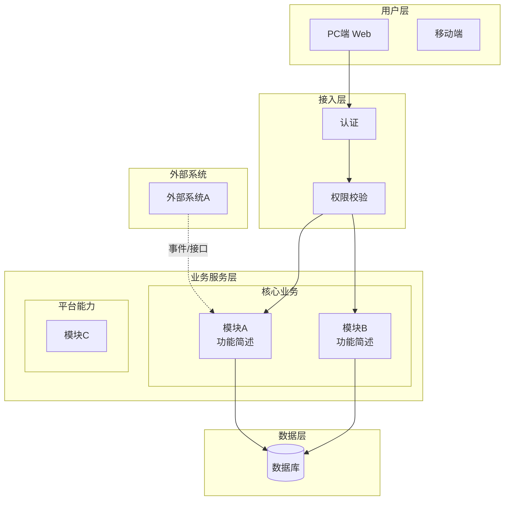
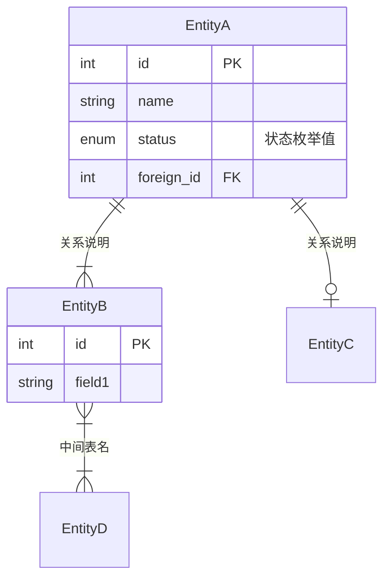
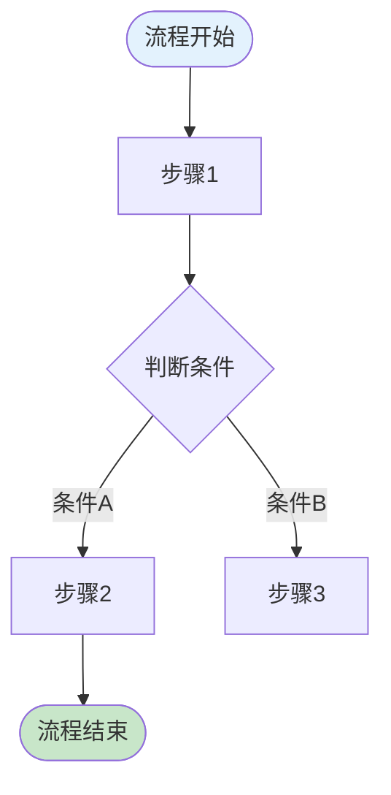
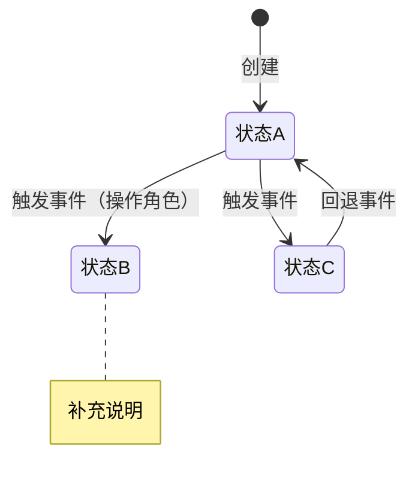

# Create-PRD 完整独立 Prompt

> 本文件是 create-prd 技能的完整独立版本，可在任何 LLM 中直接使用。

> 将本文件内容粘贴到 ChatGPT / Gemini / DeepSeek / Claude 等 LLM 中，
> 然后提供你的业务上下文，即可生成结构化 PRD。

> 本版本已内联复杂度分级与章节质量基线，无需额外预装 framework 目录。

---


============================================================

## SKILL

# create-prd

根据用户提供的业务上下文和需求背景，生成结构化的、带有初始内容的 B端 PRD 文档。

支持显式调用（如 `/create-prd`）和自动触发（当用户明确要求创建、撰写 PRD、需求文档、产品方案或企业系统设计时）。

## 输入

- 用户提供的业务上下文和需求背景（自由文本、会议纪要、简要描述等均可）
- 或通过 `$ARGUMENTS` 传入的文件路径

如有参数传入，优先作为输入源：

$ARGUMENTS

---

## 质量基线：prd-quality-framework

本 skill 与 `check-prd` 共享一套质量基线——`references/framework/`。

- **complexity-assessment.md**：L1-L4 判定 + 章节适用表 + 产品类型叠加
- **global-checks/g1-product-type-fit.md**：产品类型契合度
- **global-checks/g2-document-structure.md**：文档结构完整性（自检）
- **global-checks/g3-major-risks.md**：重大风险 R1-R8（自检）
- **chapters/chN-*.md**：每个章节的 L1-L4 质量标准（写作目标）

**加载原则：渐进式**——只在当前阶段加载必要文件，不要预读整个框架。

---

## 生成流程

严格按以下顺序执行，不可跳过或调换步骤。

### 阶段 0：理解上下文 → 产品定型 → 需求分级

1. 完整阅读并理解用户提供的所有业务上下文。

2. 加载：
   - `references/framework/complexity-assessment.md`
   - `references/framework/global-checks/g1-product-type-fit.md`

3. 从用户描述中推断：
   - **商业属性**：商业化产品 or 企业自研系统
   - **功能类型**：业务管理型 / 工具型 / 交易平台型 / 基础服务型

4. 用一句话向用户呈现推断结果，请求确认：

   > 根据你的描述，这是一个【{商业属性} × {功能类型}】产品{，简要理由}。我会据此调整 PRD 各章节的侧重点。如有不对请纠正。

5. 等待用户确认后再继续。

6. **需求分级**：按 `complexity-assessment.md §1` 的四步法（先一句话用户视角描述 → 决策树 → 歧义消解 → 辅助信号）判定 L1 / L2 / L3 / L4。

7. 向用户确认需求级别：

   > 根据描述，这是一个 **L{X}（{级别名}）** 需求，我会生成 **{体量描述}** 的文档。如需调整深度请告诉我。

8. 等待用户确认。按 `complexity-assessment.md §3` 的章节适用表和 §4 的产品类型叠加规则，确定哪些章节需要生成、各章节深度到哪一层。

---

### 阶段 1：章节生成（按 L 级裁剪）

对当前 L 级适用的每一章，执行：

**Step 1** — 加载**质量标准**（写作目标）：
`references/framework/chapters/chN-*.md`

**Step 2** — 加载**生成指引**（模板/Mermaid/表格结构）：
`references/chapters/create-prd-chN-*.md`

**Step 3** — 写该章内容，必须命中 L 级对应的 Must 项，可覆盖 Should 项。写完立即输出。

**Step 4** — 完成该章后不再保留两个文件在上下文，进入下一章。

#### 章节顺序与适用性

按 `complexity-assessment.md §3` 的章节适用表裁剪。常见映射：

| L 级 | 需要生成的章节 |
|------|--------------|
| L1 | 变更说明（可套用 Ch10.2 配置级模板）+ 影响范围（Ch6 轻量）+ TBD |
| L2 | Ch1(简化)、Ch2(简化)、Ch6(轻量)、Ch10.1(流程图必需)、Ch10.2、Ch10.3、Ch14 |
| L3 | Ch1、Ch2、Ch6、Ch10.1-10.3、Ch11(可选)、Ch12(变更部分)、Ch13(上线+回滚)、Ch14 |
| L4 | 全量 Ch1-Ch14 |

**生成指引目录**（与 `prd-quality-framework/chapters/` 一一对应）：

1. Ch1  → `references/chapters/create-prd-ch01-background.md`
2. Ch2  → `references/chapters/create-prd-ch02-basic.md`
3. Ch3  → `references/chapters/create-prd-ch03-commercial.md`
4. Ch4  → `references/chapters/create-prd-ch04-goals.md`
5. Ch5  → `references/chapters/create-prd-ch05-overview.md`
6. Ch6  → `references/chapters/create-prd-ch06-scope.md`
7. Ch7  → `references/chapters/create-prd-ch07-risks.md`
8. Ch8-9 → `references/chapters/create-prd-ch08-09-terms.md`
9. Ch10 → `references/chapters/create-prd-ch10-functions.md` (含 10.1/10.2/10.3)
10. Ch11 → `references/chapters/create-prd-ch11-tracking.md`
11. Ch12 → `references/chapters/create-prd-ch12-permissions.md`
12. Ch13 → `references/chapters/create-prd-ch13-operations.md`
13. Ch14 → `references/chapters/create-prd-ch14-tbd.md`

---

### 阶段 2：自检（L3/L4 必做，L1/L2 跳过）

L3/L4 级别生成完毕后执行轻量自检：

**Step 1** — 加载 `references/framework/global-checks/g2-document-structure.md`，扫描：
- 章节覆盖是否与 L 级匹配
- **Ch1→Ch4→Ch10 逻辑链路是否贯通**（最核心）
- Ch10 内部三块（10.1/10.2/10.3）是否对齐
- Ch4→Ch11 目标是否都可度量
- Ch6→Ch12 角色/系统范围是否自洽
- 术语/角色名是否全文一致

**Step 2** — 加载 `references/framework/global-checks/g3-major-risks.md`，扫描 R1-R8 中的高严重度风险，在文末列出待完善清单。

自检输出写入 PRD 文末的"附：待完善清单"区域。

---

## 输出规范

### 文档格式

以单个 Markdown 文档输出 PRD，结构如下：

```md
# {产品/项目名称} PRD

| PRD 审核人 | {待填写} |
| --- | --- |
| 重要性 | {高/中/低} |
| 紧迫性 | {高/中/低} |
| 需求方 | {从上下文推断或标注待填写} |
| PRD 编写人 | {用户姓名或待填写} |
| PRD 提交日期 | {当前日期} |

## PRD 修改记录

| 变更时间 | 变更内容 | 变更提出部门与理由 | 修改人 | 审核人 | 版本号 |
| --- | --- | --- | --- | --- | --- |
| {当前日期} | 初始版本 | — | {编写人} | {待填写} | v1.0 |

---

## 1、项目背景
...（各章节内容）

## 14、待决事项
...

---

## 附：待完善清单
...（阶段 2 自检输出）
```

### 内容生成规则

1. **有信息则生成实质内容**：根据用户提供的上下文，尽可能生成具体、有实质内容的初稿。
2. **信息不足则标注 `[TODO]`**：对于用户未提供足够信息的部分，用 `[TODO: 具体需要补充什么]` 标注，而不是编造内容。
3. **按 L 级裁剪**：严格遵守章节适用表，不在低 L 级需求中过度设计。
4. **按产品类型调整**：商业化产品与企业自研系统的内容侧重点不同。
5. **质量标准对齐**：每章必须命中 `prd-quality-framework/chapters/chN-*.md` 对应 L 级的 **Must** 项。
6. **理论框架外显**：在关键章节中，用简短提示说明所使用的方法论框架（格式 `> 💡 方法论提示：`）。
7. **结构化优先**：表格、列表、Mermaid 图表优先于大段叙述。
8. **图表使用 Mermaid**：架构图、流程图、状态机、ER 模型等全部使用 Mermaid 代码块生成，不使用 ASCII 伪图。

### 图表生成规则

第10章产品框架概述中，以下图表**必须使用 Mermaid 语法**：

| 图表类型 | Mermaid 语法 | 必须包含 |
| --- | --- | --- |
| 应用架构图 | `graph TB` + `subgraph` 分层 | 用户层、接入层、业务服务层、数据层、外部系统 |
| ER 数据模型 | `erDiagram` | 所有核心实体+关系+关键属性（PK/FK/状态） |
| 业务流程图 | `flowchart TD` 或泳道 | 主流程+关键分支+异常路径 |
| 状态机图 | `stateDiagram-v2` | 正常+异常路径，附 note 说明约束 |

**注意事项：**
- Mermaid 图后面附对应的明细表格作为补充说明（如状态机图+状态转换表）
- 图表内节点文字用 `<br/>` 换行，保持简洁
- 具体模板和示例见第10章生成指引文件

### 逐章输出规则

- 每完成一章立即输出，不要等所有章节完成后再一起输出。
- 每章必须有清晰的章节标题，与 PRD 模板结构一致。
- 结构化数据（字段、权限、规则等）优先使用表格。
- 不确定的内容用 `[TODO]` 标注，并说明需要补充什么信息。

## 工作风格

- 目标是生成一份可用的 PRD 脚手架，加速产品经理的工作，而不是替代其判断。
- 用户上下文充分时，尽量具体和有实质内容；信息不足时，坦诚标注缺口。
- 保持专业的 PRD 写作风格：精确、结构化、无歧义。
- 根据用户提供的上下文丰富度调整深度——一段话的上下文生成轻量 PRD，详细上下文生成丰富 PRD。
- 如果用户提供的上下文非常有限，生成结构框架并附带指引说明，主动询问哪些补充信息有助于充实关键章节。
- **尊重渐进加载**：除非当前阶段需要，不要提前加载框架文件。


============================================================

## README

# prd-quality-framework

> **B 端 PRD 质量统一框架** — create-prd 和 check-prd 两个 skill 的共享知识基础。

## 这是什么

一套以**章节**为骨架、以 **L1-L4 复杂度分级**为深度标尺的 B 端 PRD 质量标准：

- **create-prd 按本框架写作** → 写到 L 级对应的深度即可，不过度设计
- **check-prd 按本框架审查** → 按 PRD 当前 L 级评判，避免用 L4 标准要求 L1 配置卡

两个 skill 共用同一套质量标准，形成"写-查"闭环。

## 核心设计

### 1. 四个复杂度级别

| L 级 | 定义 | 典型产出物 |
|------|------|-----------|
| L1 | 配置级 / 规则微调 | 1 页配置卡 |
| L2 | 规则级 / 轻量功能 | 2-3 页规则说明 |
| L3 | 模块级 / 完整功能块 | 5-8 页模块 PRD |
| L4 | 系统级 / 0-1 新系统 | 完整 14 章 PRD |

### 2. 十四个章节骨架

按《决胜B端》B 端 PRD 模板组织，每个章节有独立的 L1-L4 质量标准：

```
Ch1  项目背景          Ch8   术语定义
Ch2  需求基本情况      Ch9   参考文献
Ch3  商业分析          Ch10  功能需求（Ch10 分三块 10.1/10.2/10.3）
Ch4  项目目标          Ch11  数据埋点
Ch5  方案概述          Ch12  角色和权限
Ch6  项目范围          Ch13  运营方案
Ch7  项目风险          Ch14  待决事项
```

### 3. 三个全局检查

不属于任何单一章节的跨章节检查项：

- **G1 产品类型契合度**（Phase 0）：确认产品类型与方法论一致
- **G2 文档结构完整性**（Final）：章节覆盖 + 逻辑贯通 + 术语一致
- **G3 重大风险综合判断**（Final）：R1-R8 八类整体风险扫描

## 目录结构

```
prd-quality-framework/
├── README.md                        ← 本文件
├── complexity-assessment.md         ← 核心：L 级判定 + 章节适用表 + 产品类型叠加 + check 层级验证
├── chapters/                        ← 按章节的质量标准
│   ├── ch01-background.md
│   ├── ch02-basic.md
│   ├── ch03-commercial.md
│   ├── ch04-goals.md
│   ├── ch05-overview.md
│   ├── ch06-scope.md
│   ├── ch07-risks.md
│   ├── ch08-09-terms.md             ← Ch8 + Ch9 合并（都属轻量章节）
│   ├── ch10-1-framework.md          ← Ch10.1 产品框架
│   ├── ch10-2-detail.md             ← Ch10.2 需求详解
│   ├── ch10-3-exception.md          ← Ch10.3 异常处理
│   ├── ch11-tracking.md
│   ├── ch12-permissions.md
│   ├── ch13-operations.md
│   └── ch14-tbd.md
└── global-checks/                   ← 跨章节全局检查
    ├── g1-product-type-fit.md
    ├── g2-document-structure.md
    └── g3-major-risks.md
```

## 使用规则（渐进式加载）

为避免污染上下文，两个 skill 都应按需加载本框架文件，**绝不一次全读**：

### create-prd 的加载路径

1. **启动阶段**：读 `complexity-assessment.md`（判定 L 级 + 产品类型）+ `global-checks/g1-product-type-fit.md`
2. **写作章节 N 时**：加载 `chapters/chN-*.md`（只读当前写的那章）
3. **自检阶段**：读 `global-checks/g2-document-structure.md`

### check-prd 的加载路径

1. **Phase 0**：读 `complexity-assessment.md` + `global-checks/g1-product-type-fit.md`
2. **章节检查阶段**：按 PRD 实际存在的章节逐个加载对应 `chapters/chN-*.md`
3. **综合判断阶段**：读 `global-checks/g2-document-structure.md` + `global-checks/g3-major-risks.md`

## 与 check-prd 原 14 维度的关系

check-prd 仍保留原 14 个维度文件（`.agents/skills/check-prd/references/dimensions/check-prd-01~14.md`）作为**降级方案**：

- 针对不按 create-prd 格式编写的 PRD（自由格式、散装文档），无法按章节检查时
- check-prd SKILL 通过判断 PRD 结构决定走"章节路径"还是"维度路径"
- 降级路径也遵循渐进加载原则，只读与检查维度直接相关的文件

原 14 维度 → 章节的映射关系见 `complexity-assessment.md` 注释或 `lovely-bubbling-oasis.md` 计划文件。

## 章节质量标准文件格式

每个 `chapters/chN-*.md` 统一结构：

```
# ChN XXX — 质量标准

> 章节来源说明（create-prd 对应章节 + check-prd 维度来源）

## 章节目标

## 各层级质量标准
### L1（配置级）
### L2（规则级）
### L3（模块级）
### L4（系统级）

## 校验规则
（阻断项 / Warning）

## 常见问题
| 问题现象 | 根本原因 | 改进方向 |
```

这样 create 的写作要求和 check 的检查点自然合一。

## 维护规则

- 修改任何 `chapters/*` 或 `global-checks/*` 文件前，先在 `complexity-assessment.md §3` 检查该章节的 L 级适用表是否需要同步更新
- 新增章节/全局检查项时，更新本 README 目录结构
- 变更后两个 skill（create-prd、check-prd）的相关测试用例都需要回归一次


============================================================

## complexity-assessment

# 需求复杂度评估标准

> create-prd 和 check-prd 共享的统一评估框架。
> - create-prd 在阶段 0 加载，用于确定文档体量和各章节生成深度。
> - check-prd 在阶段 0 加载，用于确定评审基线和各章节合格标准。

---

## 1. 分级判断流程

### Step 1：用户视角描述变更

**在套决策树之前**，先用一句话从用户感知角度概括变更，避免被实现细节拉高级别。

> 格式：「{角色} 在 {场景} 下，{能做什么 / 感知到什么变化}」

示例：
- ✅ "采购员在提交采购单时，金额超过 10 万需要多一级总监审批" → 规则变更，L2
- ❌ "需要新增一张审批配置表来存储阈值" → 这是实现细节，不是用户感知

### Step 2：决策树判断

按**变更影响面**逐级判断，命中即停：

```
是否新建系统 / 业务域 / 子系统？ → 是 → L4（系统级）
        ↓ 否
是否新增页面、新增实体、新增角色/权限？ → 是 → L3（模块级）
        ↓ 否
是否修改/新增业务规则（校验、审批条件、计算逻辑等）？ → 是 → L2（规则级）
        ↓ 否
仅配置/文案/样式/阈值变更 → L1（配置级）
```

### Step 3：歧义消解

当需求落在两个级别的边界时，用以下规则消歧：

| 边界场景 | 判断规则 | 结论 |
| --- | --- | --- |
| 新增页面但只是已有数据的新视图（如新增一个报表页） | 是否引入了新的业务实体或角色？否 → 本质是展示层变更 | **L2**（规则级） |
| 新增实体但只是简单的字典/枚举表（如增加一个下拉选项的分类表） | 该实体是否参与核心业务流程、有独立生命周期？否 → 配置性变更 | **L2**（规则级） |
| 修改流程结构但不新增页面（如调整审批节点顺序） | 是否改变了角色职责分工或新增了审批角色？是 → 模块级 | 视情况 **L2 或 L3** |
| 跨模块的规则变更（如修改价格计算逻辑影响多个模块） | 影响的是"一条规则的多处引用"还是"多个独立规则"？ | 前者 **L2**，后者 **L3** |
| 给现有系统新增一个完整子模块 | 是否有独立的业务流程闭环？ | 有闭环 → **L4**，无闭环 → **L3** |

**原则：看用户感知的变更面，不看技术实现的变更面。**

### Step 4：复杂度信号辅助判断

当决策树结果仍有争议时，用以下信号量辅助确认：

| 信号维度 | L1 | L2 | L3 | L4 |
| --- | --- | --- | --- | --- |
| 新增实体数 | 0 | 0 | 1-3 | 4+ |
| 新增/变更角色数 | 0 | 0 | 0-1 | 2+ |
| 新增页面数 | 0 | 0 | 1-3 | 4+ |
| 跨系统集成 | 无 | 无 | 0-1 个系统 | 2+ 个系统 |
| 流程变更范围 | 无 | 单节点规则 | 局部流程调整 | 端到端流程重构 |
| 预估文档页数 | 1 页 | 2-3 页 | 5-8 页 | 10+ 页 |

> 信号量不是硬判断标准，而是在决策树结论模糊时的辅助参考。多数信号指向同一级别时，取该级别。

---

## 2. 四个级别概览

| 级别 | 名称 | 一句话定义 | 文档体量 |
| --- | --- | --- | --- |
| **L1** | 配置级 | 不涉及新页面、新实体、新流程、新角色，只改现有配置/规则/文案/样式/阈值 | 1 页变更卡片 |
| **L2** | 规则级 | 修改或新增业务规则，但不引入新实体、不新增页面 | 2-3 页轻文档 |
| **L3** | 模块级 | 新增页面、新增实体、涉及新角色/权限、或改造现有流程结构 | 5-8 页标准 PRD |
| **L4** | 系统级 | 新建业务域/子系统、跨多模块大重构、0→1 新系统 | 完整 14 章 PRD |

---

## 3. 章节适用性总表

以下表定义每个章节在各级别下的适用状态。

**适用状态说明**：
- **必选**：该章节必须覆盖，按对应级别的深度要求执行
- **精简**：该章节需覆盖，但仅需简化内容
- **按需**：满足额外条件时才适用（见「额外条件」列）
- **免除**：该级别下不适用，可跳过

| 章节 | L1 | L2 | L3 | L4 | 额外条件 |
| --- | --- | --- | --- | --- | --- |
| Ch1 项目背景 | 精简 | 必选 | 必选 | 必选 | L1 一句话；L2 两段话 |
| Ch2 需求基本情况 | 免除 | 精简 | 必选 | 必选 | L2 仅规则表；L3+ 含角色+场景 |
| Ch3 商业分析 | 免除 | 免除 | 按需 | 必选 | 商业化产品必选；自研系统替换为同类系统参考+ROI |
| Ch4 项目收益目标 | 免除 | 免除 | 必选 | 必选 | L3 为验收标准；L4 含 SMART 三层目标 |
| Ch5 方案概述 | 免除 | 免除 | 精简 | 必选 | L3 仅功能清单 |
| Ch6 项目范围 | 精简 | 精简 | 必选 | 必选 | L1/L2 为影响评估；L3 为涉及系统表 |
| Ch7 项目风险 | 免除 | 免除 | 免除 | 必选 | — |
| Ch8-9 术语与参考 | 免除 | 免除 | 免除 | 必选 | — |
| Ch10.1 产品框架概述 | 免除 | 免除 | 精简 | 必选 | L3 仅变更/新增部分；L4 全量（架构+ER+流程+状态机） |
| Ch10.2 需求详解 | 精简 | 必选 | 必选 | 必选 | L1 变更表；L2 规则+交互变更；L3/L4 逐模块交互三表+规则五分类 |
| Ch10.3 异常处理 | 必选 | 必选 | 必选 | 必选 | **所有级别必选**，深度递增 |
| Ch11 数据埋点 | 免除 | 免除 | 按需 | 必选 | — |
| Ch12 角色和权限 | 免除 | 免除 | 精简 | 必选 | L3 仅变更部分 |
| Ch13 运营方案 | 免除 | 免除 | 精简 | 必选 | L3 仅上线策略+回滚方案 |
| Ch14 待决事项 | 按需 | 按需 | 按需 | 按需 | 有则列，无则省略 |

### 全局检查项（不属于单章）

| 检查项 | 适用级别 | 说明 |
| --- | --- | --- |
| G1 产品类型适配性 | L2+ | Phase 0 前置校验：产品定型是否准确，章节适配是否正确 |
| G2 文档结构完整性 | 全部 | 最终综合评估：各级别文档结构是否符合对应模板 |
| G3 重大风险项（R1-R8） | L3+ | 最终综合评估：定位/流程/ER/权限/功能缺口/合规/多租户 |

---

## 4. 产品类型对章节的叠加影响

产品类型的影响与级别正交——在确定级别后，再叠加以下产品类型规则：

| 条件 | 影响的章节 | 调整方式 |
| --- | --- | --- |
| **商业化产品** | Ch3、Ch4 | Ch3 需含竞品分析+市场规模；Ch4 含商业目标（营收、客户数、续费率） |
| **企业自研系统** | Ch3、Ch4 | Ch3 替换为同类系统参考+痛点排序；Ch4 替换为 ROI+效率提升目标 |
| **业务型 / 交易型** | Ch10.1、Ch12 | Ch10.1 ER 模型必须完整+泳道流程图+状态机；Ch12 完整 RBAC |
| **工具型** | Ch10.1、Ch12 | Ch10.1 简化为核心使用流程；Ch12 简化角色设计 |
| **基础服务型** | Ch10.1、Ch12 | Ch10.1 侧重 API 架构+调用流程；Ch12 为 API 级权限控制 |
| **商业化 SaaS** | Ch10.1、Ch12、Ch13 | Ch10.1 增加多租户架构；Ch12 增加租户级数据权限；Ch13 增加种子客户策略 |
| **含 AI 功能** | Ch10.2 | Ch10.2 增加 AI 交互模式设计（六脉神剑框架）、可靠性设计、监控指标 |
| **0-1 新系统** | Ch10.1 | Ch10.1 必须覆盖企业架构层（应用架构+数据架构+集成治理） |

---

## 5. check-prd 级别校验规则

check-prd 在评审时应主动校验文档的复杂度级别：

### 5.1 确定级别

1. 用本文件的决策树独立判断文档的级别
2. 检查文档是否自声明了级别（如标题或元信息中标注"L3 模块级需求"）
3. 如果文档未声明级别，在评审开头声明判断结果

### 5.2 级别不匹配处理

| 情况 | 处理 |
| --- | --- |
| 文档声明 L2，但内容引入了新实体/新页面 | 标记为发现项："文档声明 L2 但引入了新实体，建议按 L3 标准补充相关章节" |
| 文档声明 L4，但实际只是模块级变更 | 提示"文档为 L4 体量但实际变更范围为 L3，部分章节可精简" |
| 文档未声明级别 | 评审开头声明："该文档为 **L{X}（{级别名}）** 需求文档" |

### 5.3 评审基线

**按实际判断的级别（非文档自声明的级别）设定评审基线**。逐章评审时：
1. 查看该章节在当前级别的适用状态（§3 章节适用性总表）
2. 加载该章节的分级质量基线文件（`chapters/ch{NN}-*.md`）
3. 使用对应级别的合格线和关键检查项进行评审
4. 评级标准（优秀/合格/待改进/严重缺失）相对于该级别的质量基线，而非 L4 标准


============================================================

## g1-product-type-fit

# G1 产品类型契合度 — Phase 0 全局检查

> 跨章节检查项。在 check-prd 进入章节级检查前、create-prd 启动写作前均需要执行。对应原 check-prd D02 产品类型识别。

## 检查目标

确认 PRD 的产品类型与其适用方法论、章节重心、质量标准一致。产品类型是全局定位，错位会导致后续所有章节的评判标准都跑偏。

## 产品类型矩阵（两轴）

**轴 1：商业属性**
- **商业化产品**：对外销售（SaaS / PaaS / API 订阅等）
- **企业自建系统**：对内使用（替代手工 / 替代旧系统 / 新业务支撑）

**轴 2：功能类型**
- **业务管理型**（CRM / OA / ERP / 进销存 / 项目管理）
- **工具型**（设计工具、数据分析、BI、知识库）
- **交易平台型**（电商、市场、撮合、结算）
- **基础服务型**（身份认证、消息、权限、API 网关、MDM）

组合形成 4×2 矩阵，用于快速定位产品。

## 执行时机

- **create-prd**：Phase 0（启动前）确定产品类型 → 选择章节重心与模板
- **check-prd**：Phase 0（章节级检查前）确认产品类型 → 识别适用章节和忽略章节

## 检查项

- [ ] **Must - 商业属性明确**
  - 要求：PRD 正文（通常在 Ch1 或 Ch3）明确声明是商业化产品还是企业自建
  - 问题标志：模糊表述"可能会对外售卖"、没有表述

- [ ] **Must - 功能类型明确**
  - 要求：属于四类中的哪一类，如存在跨类情况（如"业务管理型 + 轻量交易"），明确主次
  - 问题标志：四类都像，都不像

- [ ] **Must - 类型与章节重心一致**
  - 例 1：商业化产品必须有 Ch3 商业分析（TAM/SAM/SOM + 竞品 + 定价）
  - 例 2：企业自建可省略或简化 Ch3，但必须补充 Ch13 培训推广和旧系统替换方案
  - 例 3：交易平台型必须覆盖多方（买方/卖方/平台）角色和结算流程
  - 例 4：基础服务型重点在 Ch10.1 架构和 API 契约，Ch10.2 页面描述可简化
  - 问题标志：企业自建系统花大量篇幅分析市场规模、商业化产品完全不提商业模式

- [ ] **Should - 复杂度与类型匹配**
  - 基础服务型通常 L3+；业务管理型可能 L1-L4 都有；工具型常见 L2-L3
  - 问题标志：L1 配置卡却按商业化产品要求做完整商业分析

## 输出

G1 结论用于后续步骤：
- **类型确定** → 进入章节级检查/写作
- **类型错位** → 先协助调整类型定位，再进入后续步骤
- **类型不明** → 协助用户补充说明

## 常见问题

| 问题现象 | 根本原因 | 改进方向 |
|---------|---------|---------|
| 企业自建却做市场规模分析 | 类型定位混乱 | 先回归自建系统重心：替代/痛点/采纳 |
| 商业化却不提商业模式 | 忽视商业化属性 | 补充 TAM/SAM/SOM + 定价 + 竞品 |
| 交易平台只设计单方角色 | 缺多方视角 | 补充买方/卖方/平台三方角色和流程 |
| 基础服务写大量页面细节 | 重心错位 | 转移到架构、API 契约、SLA |


============================================================

## g2-document-structure

# G2 文档结构完整性 — Final 全局检查

> 跨章节检查项。在 check-prd 所有章节检查完毕后执行综合评估。对应原 check-prd D05 文档结构完整性。

## 检查目标

从整体视角评估 PRD 的结构完整性、逻辑贯通性、可读性——单独章节都合格不等于整体合格。

## 执行时机

- **create-prd**：生成完毕后，自检阶段执行一次
- **check-prd**：章节级检查全部完成后执行一次

## 检查项

### 结构完整性

- [ ] **Must - 章节覆盖与 L 级匹配**
  - 要求：按 `complexity-assessment.md §3` 的章节适用表，对应 L 级应有的章节都存在
  - 例 1：L4 必须有 Ch7 项目风险、Ch11 埋点、Ch13 运营方案；缺失直接扣分
  - 例 2：L1 如果写了完整 14 章，说明"过度设计"——也是问题

- [ ] **Must - 标题层级规范**
  - 要求：Markdown 标题层级正确（# 文档名 / ## 主章节 / ### 小节），无跳级、无重号
  - 问题标志：全文只用一级标题、或 ## 后直接跳到 ####

### 逻辑贯通性（**最核心**）

- [ ] **Must - Ch1→Ch4→Ch10 链路贯通**
  - 要求：Ch1 的业务问题 → Ch4 的目标 → Ch10 的功能设计应形成完整因果链
  - 验证方法：
    - Ch4 的每个目标都能在 Ch1 找到问题来源
    - Ch10 的每个核心功能都能映射到 Ch4 的某个目标
  - 问题标志：Ch10 中有"惊喜功能"找不到 Ch4 目标依据、Ch4 有目标但 Ch10 无对应功能

- [ ] **Must - Ch10 内部三块对齐**
  - 要求：10.1 的实体/模块必须在 10.2 有页面/字段描述，10.3 的异常场景必须覆盖 10.2 的核心操作
  - 问题标志：10.1 的 ER 实体在 10.2 找不到对应 CRUD 页面、10.3 与 10.2 脱节

- [ ] **Must - Ch4→Ch11 目标可度量**
  - 要求：Ch4 的每个目标都能在 Ch11 找到对应埋点或度量方式
  - 问题标志：有目标"提升审批效率 30%"但 Ch11 无审批耗时埋点

- [ ] **Must - Ch6→Ch12 范围与权限自洽**
  - 要求：Ch6 标识的受影响角色/系统都在 Ch12 权限矩阵中出现
  - 问题标志：Ch6 提到"商户运营"角色但 Ch12 权限矩阵无此角色

### 可读性

- [ ] **Should - 目录与正文一致**
  - 文首目录（TOC）与正文章节标题一一对应

- [ ] **Should - 图表编号与引用**
  - 图表有编号（图 3-1 / 表 10.2-2），正文引用时编号对应

- [ ] **Should - 跨章节引用**
  - 跨章节引用用章节号而非"上面 / 前面"，便于读者定位

### 术语与数据一致性

- [ ] **Must - 同一术语贯穿一致**
  - 例：全文是"订单" vs "履约单"不混用；"审批" vs "审核"不混用
  - 问题标志：同一实体/概念在不同章节用不同名字

- [ ] **Must - 角色名与定义对齐**
  - Ch2/Ch12 的角色名必须与 Ch10 正文使用的角色名完全一致

- [ ] **Should - 数据一致性**
  - Ch4 目标中的数字、Ch3 市场数据、Ch11 埋点指标单位一致

## 输出格式

```
【G2 文档结构完整性 - 汇总评分】
- 结构完整性：✓/✗
- 逻辑贯通性：✓/✗（含具体失联点）
- 可读性：✓/✗
- 术语一致性：✓/✗（含冲突术语清单）

阻断项：[具体列表]
Warning：[具体列表]
```

## 常见问题

| 问题现象 | 根本原因 | 改进方向 |
|---------|---------|---------|
| Ch10 有 Ch4 找不到依据的功能 | 写作过程中"加了自己觉得好"的功能 | 每个功能都要回溯到 Ch4 某个目标 |
| Ch4 目标无对应埋点 | 目标与度量脱节 | 每个目标都要定义度量方式 |
| 同一实体多个名字 | 多人协作未统一 | 最终通读时做术语统一 |
| L1/L2 写成完整 14 章 | 未按 L 级裁剪 | 参考 §3 章节适用表做裁剪 |


============================================================

## g3-major-risks

# G3 重大风险综合判断 — Final 全局检查

> 跨章节检查项。对 PRD 做整体风险评估，识别"单看每章都 ok、合起来看风险巨大"的情形。作为最终综合判断，而非独立维度检查。

## 检查目标

在所有章节检查完成后，基于通篇理解，扫描以下 8 类可能存在的重大风险（R1-R8），任何一项命中即要在总结中显式提示。

## 执行时机

- **check-prd** 章节级检查和 G2 之后，生成最终报告前
- **create-prd** 仅提示写作者注意，不强制自检（避免每次写作都做风险论断）

## 风险清单

### R1 方向风险：核心假设未经验证

- [ ] 核心业务假设（用户痛点、付费意愿、使用频率）未通过用户访谈、调研数据或 MVP 验证
- 问题信号：Ch1/Ch3 只有"我们认为""预计"，无外部数据或访谈证据
- 严重度：⭐⭐⭐（基石不稳，下游全部受累）

### R2 商业风险：价值主张不成立

- [ ] ROI 不清晰、定价模型与目标客户付费能力不匹配、缺乏商业闭环
- 问题信号：Ch3 无定价策略、或定价 vs CAC 倒挂、或缺乏续费逻辑
- 适用：仅商业化产品
- 严重度：⭐⭐⭐

### R3 资源风险：投入产出严重失衡

- [ ] 项目体量（Ch5 方案概述 + Ch10 功能范围）与 Ch4 期望收益严重失衡——投入巨大，收益有限
- 问题信号：做一个几百人月的大平台，却只服务少数用户/低频场景
- 严重度：⭐⭐

### R4 架构风险：系统设计存在根本性缺陷

- [ ] 数据模型存在根本性缺陷（错误的实体抽象、严重冗余）、系统耦合严重、无可扩展性
- 问题信号：Ch10.1 ER 图一上来就满足不了基本业务场景、系统间数据归属不清
- 严重度：⭐⭐⭐（上线后重构代价极高）

### R5 执行风险：运营保障缺位

- [ ] Ch13 运营方案缺失或过于单薄——培训/推广/反馈/激励任一缺失
- 问题信号：企业自建系统无培训计划、商业化产品无种子客户策略
- 严重度：⭐⭐（上线后没人用）

### R6 数据与合规风险

- [ ] 敏感数据（手机/身份证/财务/客户画像）无脱敏和访问控制
- [ ] 跨境数据、用户隐私（PIPL/GDPR）合规盲点
- [ ] 无操作审计、无数据备份与恢复方案
- 问题信号：PRD 涉及敏感数据但 Ch10.3 完全不提保护
- 严重度：⭐⭐⭐（合规事故代价巨大）

### R7 AI 风险（涉及 AI 功能时）

- [ ] AI 做关键业务决策但无 Human-in-the-Loop
- [ ] AI 不可用时核心业务中断（无降级方案）
- [ ] 敏感数据直接传第三方 AI 无脱敏
- [ ] AI 输出无可解释性、无质量管控
- 严重度：⭐⭐⭐

### R8 集成与上游风险

- [ ] 强依赖未落地的外部系统或团队（依赖的上游服务本身还没建好）
- [ ] 多方协作但协议未敲定（接口文档、SLA、排障流程）
- 问题信号：PRD 多处写"依赖 X 系统提供 Y 能力"但 X 系统状态未知
- 严重度：⭐⭐

## 输出格式

```
【G3 重大风险评估 - 整体判断】

命中风险：[R1, R4, R6, ...]

R1 - 方向风险：[具体描述，引用 PRD 章节]
R4 - 架构风险：[具体描述]
R6 - 数据与合规风险：[具体描述]

风险等级总评：高 / 中 / 低
推荐行动：
- [ ] 先解决 R1 的核心假设验证，再启动项目
- [ ] R4 架构建议返工重新设计 ER 模型
- [ ] R6 需要补充敏感数据保护设计后再进入评审
```

## 使用原则

- **不刷数量**：只列真实命中的风险，不为凑篇幅而列"看起来可能的"风险
- **引用证据**：每条风险描述必须引用 PRD 具体章节作为判断依据
- **给出行动**：风险不只是警告，要给出下一步建议（补充/返工/决策）
- **分级**：⭐⭐⭐ 必须立即解决；⭐⭐ 需提交决策；⭐ 可在迭代中解决


============================================================

## ch01-background

# Ch1 项目背景 — 质量标准

> 原维度来源：D01 业务分析质量（战略层+执行层）

## 适用性

| L1 | L2 | L3 | L4 |
|----|----|----|-----|
| 精简 | 必选 | 必选 | 必选 |

---

## L1 标准（配置级）

- **深度要求**：一句话说明变更原因
- **生成指引**：变更卡片中的"变更原因"字段，不单独成章
- **关键检查项**：
  1. 能回答"为什么做这个变更"
- **合格线**：变更原因与变更内容逻辑一致

---

## L2 标准（规则级）

- **深度要求**：2 段话——当前痛点 + 解决方向
- **生成指引**：输出"变更背景"章节，含业务现状和问题描述
- **关键检查项**：
  1. 痛点描述具体，有业务场景支撑（不是"提升效率"这类空话）
  2. 解决方向与痛点一一对应
  3. 能追溯到触发变更的业务事件或用户反馈
- **合格线**：读者能理解"现在什么不好、为什么要改"

---

## L3 标准（模块级）

- **深度要求**：完整的 1.1 业务现状 + 1.2 面临问题（带优先级）+ 1.3 解决思路
- **生成指引**：按 create-prd-ch01 结构生成，但 1.4 决策依据可省略
- **关键检查项**：
  1. 业务现状有具体场景（组织结构/流程/现有工具）
  2. 问题按"影响范围 × 严重程度 × 紧迫度"排序
  3. 解决思路与问题逐条对应
  4. 商业化产品：背景含市场机会或客户痛点
  5. 自研系统：背景含效率瓶颈或管理诉求（最好带数据）
- **合格线**：
  - 问题列表有明确优先级
  - 解决思路不是"建一个系统"而是说明核心策略

---

## L4 标准（系统级）

- **深度要求**：完整 4 节结构（业务现状 + 问题 + 解决思路 + 决策依据），有数据支撑
- **生成指引**：按 create-prd-ch01 完整生成
- **关键检查项**：
  1. **L3 全部检查项**，加上：
  2. 决策依据有数据支撑（业务量、成本、效率数据等）
  3. 战略层分析：说明项目如何支撑业务/公司战略目标
  4. 调研方法与数据来源有说明（访谈对象、时间、数据口径）
  5. 如涉及强监管行业，列出政策法规约束
- **合格线**：
  - 背景描述能让未参与项目的人完整理解项目来龙去脉
  - 有定量数据支撑（即使是粗略估算）
  - 战略→问题→方案三层逻辑可追溯


============================================================

## ch02-basic

# Ch2 需求基本情况 — 质量标准

> 原维度来源：D01 业务分析质量（战术层）+ D04 场景分析与用户旅程

## 适用性

| L1 | L2 | L3 | L4 |
|----|----|----|-----|
| 免除 | 精简 | 必选 | 必选 |

---

## L2 标准（规则级）

- **深度要求**：规则变更涉及的角色 + 受影响场景简述
- **生成指引**：在"变更背景"后附一段"影响角色与场景"说明
- **关键检查项**：
  1. 列出受影响的用户角色（至少区分操作者和审批者）
  2. 说明规则变更在什么场景下触发
- **合格线**：能回答"谁在什么时候会碰到这个变更"

---

## L3 标准（模块级）

- **深度要求**：完整的角色清单 + 核心场景描述（六要素）+ 痛点与价值
- **生成指引**：按 create-prd-ch02 结构生成（元信息表 + 角色分类 + 场景六要素）
- **关键检查项**：
  1. 角色三分类完整：需求提出人、功能使用人、受影响人
  2. 至少 1 个核心场景用六要素完整描述（人物/时间/地点/起因/经过/结果）
  3. 场景是具体业务故事，不是抽象功能描述
  4. 核心痛点具体可追溯（不是"提升效率"）
  5. 标注场景发生频率（高频/中频/低频）
- **合格线**：
  - 三类角色均已识别
  - 核心场景能被开发人员理解并据此设计

---

## L4 标准（系统级）

- **深度要求**：全量角色画像 + 多场景覆盖（正常/异常/边界）+ 端到端用户旅程 + 场景到功能追溯
- **生成指引**：按 create-prd-ch02 完整生成，含用户画像表和用户旅程图
- **关键检查项**：
  1. **L3 全部检查项**，加上：
  2. 用户画像含岗位、技术熟练度、使用频率、核心任务
  3. 区分决策者/管理者/执行者/协作者四层用户
  4. 场景覆盖正常流程、异常场景（权限不足/数据不全等）、边界场景
  5. 有端到端用户旅程（含阶段划分、接触渠道、情绪曲线、痛点标注）
  6. 多角色系统：用泳道图展示多角色协作旅程
  7. 线上线下场景衔接点标注
  8. 每个功能可追溯到对应场景编号
- **合格线**：
  - 角色画像足够具体，能指导交互设计
  - 场景覆盖不低于 3 个（含至少 1 个异常/边界场景）
  - 功能清单可逆向追溯到场景


============================================================

## ch03-commercial

# Ch3 商业分析 — 质量标准

> 原维度来源：D03 产品定位合理性 + D10 商业分析深度

## 适用性

| L1 | L2 | L3 | L4 |
|----|----|----|-----|
| 免除 | 免除 | 按需 | 必选 |

> L3 按需条件：商业化产品必选（简化版）；自研系统替换为同类系统参考+ROI。

---

## L3 标准（模块级）

### 商业化产品

- **深度要求**：简化版市场分析——目标客户画像 + 2-3 个竞品对比 + 差异化定位
- **生成指引**：生成 3.1 目标市场（简化）+ 3.2 竞品分析 + 3.3 差异化定位
- **关键检查项**：
  1. 目标客户具体到行业+规模+发展阶段（不是"所有企业"）
  2. 至少 2 个竞品进行对比分析
  3. 有明确的差异化定位声明（不是"我们更好"）
  4. 客户痛点可追溯到 Ch1 的问题描述
- **合格线**：能回答"为什么客户选你而不选竞品"

### 企业自研系统

- **深度要求**：同类系统调研 + 业务痛点优先级
- **生成指引**：生成"业务分析与系统调研"（替换版 Ch3）
- **关键检查项**：
  1. 调研了至少 1 个内部现有系统和 1 个外部参考系统
  2. 痛点有优先级排序（影响范围 × 严重度 × 紧迫度）
  3. 有初步的投入产出评估
- **合格线**：能回答"为什么不用现有系统改造，而要新建/大改"

---

## L4 标准（系统级）

### 商业化产品

- **深度要求**：完整商业分析——市场规模(TAM/SAM/SOM) + 客户画像 + 竞品分析 + 差异化 + 商业模式
- **生成指引**：按 create-prd-ch03 完整生成，SaaS 产品额外生成 3.4 商业模型预估
- **关键检查项**：
  1. **L3 全部检查项**，加上：
  2. 市场规模有估算方法和数据来源（TAM/SAM/SOM）
  3. 市场特征与趋势有行业依据
  4. 竞品分析至少 3 个，含直接/间接/替代方案
  5. 竞品从商业模式、目标客户、功能、价格、服务等维度对比
  6. 产品定位声明清晰（为谁、解决什么、提供什么价值）
  7. 功能边界明确（做什么和不做什么）
  8. SaaS 产品：有 CAC/LTV/MRR/Churn Rate 预估，LTV/CAC > 3
- **合格线**：
  - 市场分析有数据支撑（即使是粗略估算）
  - 竞品分析能指导产品差异化策略
  - SaaS 产品的商业模型健康度可评估

### 企业自研系统

- **深度要求**：完整业务分析——同类系统对标 + 痛点分级 + 投入产出分析（含 ROI）
- **生成指引**：按 create-prd-ch03 企业自研版完整生成
- **关键检查项**：
  1. **L3 自研版全部检查项**，加上：
  2. 投入产出分析含具体数字（人力、工期、预算）
  3. 效率提升有量化预期（节省工时 %、降低错误率 %）
  4. 有机会成本考量（对比备选方案）
  5. ROI 有估算
- **合格线**：
  - 投入产出分析能支撑立项决策
  - 效率提升预期有可衡量的基线和目标


============================================================

## ch04-goals

# Ch4 项目收益目标 — 质量标准

> 原维度来源：D03 产品定位合理性（目标与收益部分）

## 适用性

| L1 | L2 | L3 | L4 |
|----|----|----|-----|
| 免除 | 免除 | 必选 | 必选 |

---

## L3 标准（模块级）

- **深度要求**：验收标准 + 简化版成功指标
- **生成指引**：生成目标表（核心业务目标 + 效率目标）+ 验收标准列表
- **关键检查项**：
  1. 目标遵循 SMART 原则（尤其"可衡量"和"有时限"）
  2. 目标不是"按时上线"，而是业务价值层面
  3. 验收标准具体可执行（功能完整性 + 性能 + 安全）
  4. 目标数量合理（3-5 个核心目标）
- **合格线**：
  - 每个目标有明确的度量指标
  - 验收标准能直接用于测试验收

---

## L4 标准（系统级）

- **深度要求**：三层目标分解（战略→产品→功能）+ 验收标准 + 成功标准 + 度量方式
- **生成指引**：按 create-prd-ch04 完整生成（目标表 + 验收标准 + 成功标准）
- **关键检查项**：
  1. **L3 全部检查项**，加上：
  2. 战略目标→产品目标→功能目标三层可追溯
  3. 区分验收标准（交付时检查）和成功标准（上线后评估）
  4. 成功标准有评估周期（上线后 X 个月）
  5. 度量方式明确（数据采集方案、评估频率）
  6. 商业化产品：含商业目标（营收/客户数/续费率/NPS）
  7. 自研系统：含效率目标（工时节省/错误率/采纳率）+ ROI
- **合格线**：
  - 三层目标逻辑自洽
  - 成功标准有数据支撑的评估方案
  - 能在项目结束后据此评判项目是否成功


============================================================

## ch05-overview

# Ch5 方案概述 — 质量标准

> 原维度来源：D06 架构设计质量（概览部分）+ D11 MVP 策略

## 适用性

| L1 | L2 | L3 | L4 |
|----|----|----|-----|
| 免除 | 免除 | 精简 | 必选 |

---

## L3 标准（模块级）

- **深度要求**：功能清单表（模块+描述+优先级）+ MVP 范围边界
- **生成指引**：生成 5.1 核心功能概述表；5.3 MVP 范围（如适用）
- **关键检查项**：
  1. 功能模块按业务逻辑组织（不是技术模块）
  2. 每个模块有一句话描述
  3. 优先级标注清晰（P0/P1/P2）
  4. MVP 功能集能支撑核心业务流程闭环
- **合格线**：功能清单覆盖本次需求范围，无遗漏

---

## L4 标准（系统级）

- **深度要求**：功能清单 + 方案概述（产品/技术/运营三维）+ MVP 范围 + 核心验证假设 + 版本路线图
- **生成指引**：按 create-prd-ch05 完整生成
- **关键检查项**：
  1. **L3 全部检查项**，加上：
  2. 方案概述覆盖产品策略、技术策略、运营策略
  3. MVP 范围有明确的包含/不包含清单和理由
  4. 核心验证假设明确（MVP 要验证什么）
  5. 版本路线图有 3-4 个阶段规划
  6. 功能优先级有排序依据（价值/成本矩阵或 ICE 评分）
  7. 架构预留：MVP 阶段就考虑数据模型扩展性
- **合格线**：
  - MVP 沿核心流程走查无断点
  - 版本路线图从 MVP 到长期目标有清晰演进逻辑


============================================================

## ch06-scope

# Ch6 项目范围 — 质量标准

> 原维度来源：D11 MVP 策略（范围部分）

## 适用性

| L1 | L2 | L3 | L4 |
|----|----|----|-----|
| 精简 | 精简 | 必选 | 必选 |

---

## L1 标准（配置级）

- **深度要求**：影响评估（受影响页面/角色/接口）
- **生成指引**：变更卡片中的"边界与影响"部分
- **关键检查项**：
  1. 列出受影响的页面和角色
  2. 说明是否需要数据刷新
- **合格线**：影响范围无遗漏

---

## L2 标准（规则级）

- **深度要求**：影响范围（受影响页面/角色/接口）
- **生成指引**：在文档的"验收标准+影响范围"章节中体现
- **关键检查项**：
  1. 受影响页面列表完整
  2. 受影响角色列表完整
  3. 受影响接口列表完整
- **合格线**：开发团队能据此评估改动范围

---

## L3 标准（模块级）

- **深度要求**：涉及系统表 + 影响范围（用户/流程/数据/上下游）+ 不在本期范围
- **生成指引**：按 create-prd-ch06 生成（系统表 + 影响范围 + 排除项）
- **关键检查项**：
  1. 涉及系统列表含关系类型和责任方
  2. 影响范围覆盖用户、流程、数据三维度
  3. 有明确的"不在本期范围"列表（防止范围蔓延）
- **合格线**：范围边界清晰，排除项有理由

---

## L4 标准（系统级）

- **深度要求**：完整系统地图 + 四维影响分析 + 排除项 + 数据迁移范围
- **生成指引**：按 create-prd-ch06 完整生成
- **关键检查项**：
  1. **L3 全部检查项**，加上：
  2. 系统架构图展示本系统与周边系统关系
  3. 上下游系统的接口交互明确（调用方向、数据格式、频率）
  4. 数据迁移范围和策略（如涉及）
  5. 排除项有优先级标注（后续版本可能纳入）
- **合格线**：
  - 所有涉及系统的责任方已明确
  - 排除项不会导致核心流程断裂


============================================================

## ch07-risks

# Ch7 项目风险 — 质量标准

> 原维度来源：D12 异常处理与健壮性（风险识别部分）

## 适用性

| L1 | L2 | L3 | L4 |
|----|----|----|-----|
| 免除 | 免除 | 免除 | 必选 |

---

## L4 标准（系统级）

- **深度要求**：前提假设 + 约束条件 + 风险清单（产品/运营/技术/合规四类）+ 应对方案
- **生成指引**：按 create-prd-ch07 完整生成
- **关键检查项**：
  1. 前提假设明确，且说明假设不成立时的影响
  2. 约束条件列出，且说明对设计的影响
  3. 风险覆盖产品、运营、技术三类（合规按需）
  4. 每个风险有概率和影响评估（高/中/低）
  5. 每个风险有应对方案（不是只列风险不给方案）
  6. 风险数量合理（3-8 个，既不遗漏也不泛化）
- **合格线**：
  - 风险清单能帮助项目团队提前准备预案
  - 高概率×高影响的风险有具体的应对措施


============================================================

## ch08-09-terms

# Ch8-9 术语与参考文献 — 质量标准

> PRD 第8章 术语定义 / 第9章 参考文献。两章在 create 时可以合并写作，但属于文档素养类章节，对 L1/L2 免除，从 L3 起要求。

## 章节目标

- **Ch8 术语定义**：统一团队对业务专业术语的理解，避免沟通歧义。
- **Ch9 参考文献**：列出方法论来源、行业报告、同类产品、内部既有文档，提高 PRD 可追溯性。

## 各层级质量标准

### L1（配置级 / 规则级轻量）：**免除**

一页配置卡不涉及术语歧义和外部依赖。

### L2（规则级）：**免除**

规则类需求通常基于已有系统，术语沿用既有 PRD，不强制单独维护。

### L3（模块级）

#### Ch8 术语定义

- [ ] **Must - 核心业务术语**
  - 覆盖内容：列出本模块首次引入的业务术语（≥3个），每个术语一句话定义
  - 格式：`| 术语 | 英文缩写 | 定义 | 示例 |`
  - 问题标志：PRD 中反复出现的业务概念（如"活动""券""店长"）无定义，不同人理解不同

- [ ] **Must - 歧义术语澄清**
  - 要求：存在多义或行业惯用法不统一的术语（如 "SKU / SPU"、"订单 / 履约单 / 发货单"），必须明确本 PRD 采用的定义

#### Ch9 参考文献

- [ ] **Should - 方案来源可追溯**
  - 要求：列出关键方案的依据来源——竞品调研截图、业务侧提供的文档、既有 PRD 链接、设计稿链接
  - 问题标志：PRD 中的关键结论（如"行业常见做法是 X"）无出处

### L4（系统级）

在 L3 基础上增加：

#### Ch8 术语定义

- [ ] **Must - 完整术语表**
  - 要求：覆盖所有核心业务域的术语（通常 10+）；区分业务术语、系统术语、角色术语
  - 建议分组：业务域术语 / 系统/模块术语 / 角色与组织术语 / 指标术语

- [ ] **Must - 与上游对齐**
  - 要求：如公司有主数据字典、业务术语库（MDM/数据治理平台），本术语表要与其对齐或标注差异

#### Ch9 参考文献

- [ ] **Must - 分类列出**
  - 分类：① 方法论（书籍/框架）② 行业报告与市场数据 ③ 竞品分析与调研记录 ④ 内部既有文档（PRD、战略文档、调研报告）⑤ 设计与技术规范
  - 每项标注：名称 / 作者或出处 / 链接 / 引用位置

- [ ] **Must - 数据类引用标注时效**
  - 要求：引用的市场规模、竞品数据、调研数据要标注采集时间（避免使用过期数据做决策）

## 校验规则

- **Ch8 优先级判定**：PRD 中涉及 ≥3 个行业特有术语但无定义 → 质量不达标
- **Ch9 优先级判定**：PRD 中明显引用了外部方案（如"参考 Salesforce 的做法"）但无参考链接 → 质量不达标
- 对纯自研场景、术语完全沿用公司既有体系时，Ch8/Ch9 可以标注"沿用 XXX 文档"，避免重复劳动

## 常见问题

| 问题现象 | 根因 | 改进方向 |
|---------|------|---------|
| 术语表只是把产品功能名罗列一遍 | 混淆了"术语"和"功能" | 只收录需要解释的业务概念，不是功能名 |
| 参考文献空白 | PRD 作者默认方案"是自己想的" | 回顾方案形成过程，竞品、旧文档、行业报告都应列出 |
| 术语表很长但没人用 | 术语和正文脱节 | 正文首次出现术语时带括号注英文缩写 |


============================================================

## ch10-1-framework

# Ch10.1 产品框架概述 — 质量标准

> PRD 第10.1 节。对应 create-prd 的 10.1（应用架构图 + 数据模型 + 核心流程），对应 check-prd 原 D06 架构设计、D07 数据建模、D08 流程与角色设计的"架构/建模/流程宏观层"部分。
> **这是 Ch10 的第一块**，负责"骨架"——应用架构、数据模型、核心流程。不包含页面字段级细节（归 Ch10.2）、不包含异常场景（归 Ch10.3）。

## 章节目标

用一组结构化图表建立产品的骨架：
1. **应用架构图**：回答"系统由哪些模块组成、与外部系统什么关系"
2. **数据模型 / ER 图**：回答"系统有哪些核心实体、实体间什么关系"
3. **核心业务流程图**：回答"业务如何端到端跑通、各角色各自做什么"

## 各层级质量标准

### L1（配置级）：**免除**

一页配置卡不涉及架构、建模、流程。直接在 Ch10.2 描述规则即可。

### L2（规则级）

- [ ] **Must - 受影响模块定位**
  - 要求：说明规则挂在系统中的哪个模块、触发点（创建时 / 审批时 / 结算时）
  - 形式：一段文字或一张局部上下文图即可，不要求完整架构图

- [ ] **Must - 流程示意**（根据 §4 加成规则，L2 起必须提供流程图）
  - 要求：提供一张轻量流程图，展示规则触发点在业务流程中的位置（Happy Path 即可）
  - 形式：文字描述 + Mermaid `graph LR` 或泳道图均可
  - 问题标志：规则是"审批通过后执行"，但流程图中找不到审批通过这个节点

- [ ] **Should - 涉及的数据实体**
  - 要求：列出规则读取/写入的数据实体和字段（≤5 个），无需完整 ER 图

### L3（模块级）

#### 10.1.1 应用架构图

- [ ] **Must - 模块上下文图**
  - 要求：画出本模块在所在系统中的位置，上下游依赖模块、外部系统接口要标注清楚
  - 形式：Mermaid `graph TB` 或 `graph LR`，分层清晰
  - 问题标志：只画了本模块内部细节，未体现与周边模块的关系

- [ ] **Should - 复用与新建标注**
  - 要求：对每个功能块标注"新建 / 复用既有服务 / 外部接口"，避免重复造轮子

#### 10.1.2 数据模型（ER 图）

- [ ] **Must - 核心实体与关系**
  - 要求：ER 图覆盖本模块涉及的所有核心实体（通常 3-7 个），关系类型（1:1 / 1:* / *:*）准确
  - 形式：Mermaid `erDiagram` 或同等表达
  - 问题标志：PRD 中描述的业务场景在 ER 图中找不到数据支撑

- [ ] **Must - 关键字段清单**
  - 要求：每个核心实体列出 ID、关键业务字段、状态字段、创建/更新时间戳
  - 格式：表格呈现，字段名 + 类型 + 约束（必输/唯一/长度）+ 备注

- [ ] **Must - 状态机图**（对所有有状态实体）
  - 要求：订单、工单、审批单、任务等有生命周期的实体必须有状态机图，覆盖所有状态和转换路径（含撤回、驳回、超时等逆向路径）
  - 问题标志：有状态实体但只文字描述、或状态机只有正向路径

#### 10.1.3 核心业务流程

- [ ] **Must - 跨部门泳道图**
  - 要求：核心业务流程用泳道图呈现，泳道按角色划分，每个步骤有明确起止，判断节点有清晰分支条件
  - 形式：Mermaid `sequenceDiagram` 或 PlantUML 泳道图
  - 问题标志：只有线性文字流程，未区分角色；判断节点只画一个分支

- [ ] **Must - 流程完整闭环**
  - 要求：从业务发起到业务结束，所有环节都有功能支撑，无"断头路"——创建后能编辑/审批/执行/结束
  - 问题标志：创建了订单但没有发货功能；审批通过后无后续处理

- [ ] **Should - 审批流程细节**（涉及审批时）
  - 要求：审批节点、审批人（角色/个人/条件触发）、审批动作（通过/驳回/转交/加签）、超时处理、审批记录保留

### L4（系统级）

在 L3 基础上增加：

#### 10.1.1 应用架构图

- [ ] **Must - 企业应用版图定位**
  - 要求：说明本系统在公司整体应用版图中的位置、所属业务域、与哪些现有系统存在边界
  - 要求：说明 make-or-buy 决策——为什么选择自研而非采购或扩展现有系统

- [ ] **Must - 基础服务识别**
  - 要求：识别可复用的基础服务（权限、消息、组织架构、SSO、MDM 等），明确哪些能力由公司既有基础服务提供
  - 问题标志：每个业务模块都自建通用能力

- [ ] **Must - 多端架构**（涉及多端时）
  - 要求：明确 PC Web / 移动 App / 小程序各端的功能差异和互补关系，后端服务统一
  - 问题标志：多端各自为政，未考虑数据一致性和功能互补性

#### 10.1.2 数据模型

- [ ] **Must - 数据域与数据主权**
  - 要求：标注哪些实体是本系统的 System of Record，哪些来自外部系统；外部数据的同步策略（实时/定期/副本）
  - 问题标志：同一业务实体（如"客户"）在多个系统中都有独立完整数据集

- [ ] **Must - 主数据管理（MDM）策略**
  - 要求：涉及主数据（客户、产品、员工、组织）时明确权威来源系统、接入方式、变更通知机制

- [ ] **Should - 数据模型前瞻性**
  - 要求：关键实体预留扩展空间（可扩展属性、枚举预留），对可能的业务演变有建模预判

#### 10.1.3 核心流程

- [ ] **Must - 流程分层**
  - 要求：先一张总体流程图（5-7 个关键阶段），再对复杂阶段展开子流程；总体与子流程有清晰引用关系
  - 问题标志：一张流程图塞入所有细节，密密麻麻无法阅读

- [ ] **Must - 功能架构图**
  - 要求：除业务流程外，还需提供功能架构图（3-4 层：导航大类 → 功能模块 → 页面 → 核心功能点），体现产品的能力结构

- [ ] **Should - 集成模式选择**
  - 要求：与外部系统集成时，根据场景选择合适集成模式（实时 API / 事件驱动 / 批量 ETL），说明理由
  - 问题标志：所有集成都用实时 API（高耦合、级联故障风险）

## 校验规则

- **阻断项**：L3/L4 缺失应用架构图或 ER 图 → 必须要求补充
- **阻断项**：L2 起缺少流程图 → 必须要求补充（§4 加成规则）
- **Warning**：有状态实体缺状态机图、多端无统一架构设计

## 常见问题

| 问题现象 | 根本原因 | 改进方向 |
|---------|---------|---------|
| 无应用架构图 | 直接进入功能设计，缺少宏观视角 | 先画应用架构图，明确系统边界和外部关系 |
| 功能有"断头路" | 未做端到端流程验证 | 沿核心业务流程走查，确保每个环节都有功能支撑 |
| 无 ER 图 | 跳过建模直接画页面 | 先画 ER 图，再设计页面和交互 |
| 实体过多过碎 | 未做合理抽象 | 识别相似实体进行抽象合并 |
| 状态只能正向流转 | 状态机设计不完整 | 补充撤回、驳回、超时等逆向路径 |
| 多端设计各自为政 | 未从统一架构视角设计 | 明确各端定位差异，后端服务统一 |


============================================================

## ch10-2-detail

# Ch10.2 需求详解 — 质量标准

> PRD 第10.2 节。对应 create-prd 的 10.2（页面级详细设计），对应 check-prd 原 D04 功能描述粒度、D07 数据建模（字段级）、D08 流程与角色（权限矩阵）、D09 交互设计、D13 AI 功能（若涉及）。
> **这是 Ch10 的主体**，逐页面/逐功能点说清楚"字段、规则、交互、状态"。是 PRD 最厚重、也是最容易出质量问题的章节。

## 章节目标

对每个页面/每个功能点做字段级、规则级、交互级的详尽描述，保证研发可以无歧义地实现。

## 各层级质量标准

### L1（配置级）

- [ ] **Must - 配置项完整描述**
  - 要求：列出所有新增/修改的配置项，每项标注：名称、类型、取值范围、默认值、生效范围、影响面
  - 形式：表格即可
  - 问题标志：只说"新增 X 配置"，没说取值范围和影响

- [ ] **Must - 生效逻辑与回滚**
  - 要求：配置生效的触发时机（保存即生效 / 下次登录生效 / 定时刷新）、回滚方式

### L2（规则级）

- [ ] **Must - 规则五要素**（《决胜B端》规则类型）
  - 要求：每条规则说清楚 ① 触发条件 ② 约束/校验 ③ 推论/计算 ④ 不满足条件时的响应 ⑤ 例外情况
  - 问题标志：只写"满足 A 条件时做 B"，未交代 A 不满足时会发生什么

- [ ] **Must - 规则示例或用例**
  - 要求：每条核心规则配 1-2 个业务用例（输入→输出），用例要能覆盖正常和边界情况
  - 问题标志：规则描述完全抽象，没有具体例子

- [ ] **Should - 涉及的字段清单**
  - 要求：规则读取/写入/影响的字段列清楚，便于研发快速定位

### L3（模块级）

对每个页面做以下级别的描述：

#### 10.2.x.1 业务流程（本功能局部流程）

- [ ] **Must**：局部业务流程图，与 10.1.3 主流程对齐

#### 10.2.x.2 列表页 / 列表视图

- [ ] **Must - 列表页标准要素**
  - 查询条件区：简单查询字段 + 高级查询切换
  - 列表展示区：展示字段清单 + 字段说明 + 排序规则 + 分页 + 列定制
  - 批量操作区（如有）
  - 行内操作入口（查看/编辑/删除等）
  - 空状态设计（友好提示 + 引导入口）
  - 问题标志：无查询功能、无分页或分页不合理、无空状态

- [ ] **Must - 字段级描述**
  - 查询字段：字段名 + 字段类型（输入框/下拉/日期）+ 默认值 + 可选项/校验规则
  - 列表字段：字段名 + 数据类型 + 格式化规则 + 是否可排序 + 权限控制

#### 10.2.x.3 表单页（新建/编辑）

- [ ] **Must - 字段级结构化表格**
  - 必含：字段名称 / 字段类型 / 是否必填 / 默认值 / 长度限制 / 校验规则 / 联动规则 / 开放修改范围
  - 问题标志：仅列字段名，无校验规则和联动；长表单不支持暂存/草稿

- [ ] **Must - 提交与反馈**
  - 成功提示、失败提示、提交中状态、二次确认（如涉及危险操作）

#### 10.2.x.4 详情页

- [ ] **Must - 信息分组与操作入口**
  - 按业务逻辑分组展示字段（基本信息、业务信息、关联数据、操作记录）
  - 操作入口位置明确，高频操作突出

#### 10.2.x.5 交互设计（专项）

- [ ] **Must - 弹出层类型选择**（最常见错误来源）
  - 模态弹窗：仅用于简单确认类操作
  - 抽屉：用于对照背景数据的详情/编辑
  - 跳转新页：用于字段多（>10）的复杂表单
  - Toast/Snackbar：用于轻量反馈
  - 问题标志：复杂表单塞进模态弹窗、简单操作结果用弹窗反馈

- [ ] **Must - 操作反馈与错误预防**
  - 每个操作有加载/成功/失败三种反馈
  - 危险操作有二次确认且按钮为危险色
  - 异步操作有进度指示

- [ ] **Should - 一致性**
  - 相同操作在不同页面保持一致交互方式（查询、删除、保存逻辑统一）

#### 10.2.x.6 权限矩阵（字段级/操作级）

- [ ] **Must - 精确到元素级**
  - 要求：以矩阵表格列出每个角色在每个页面、每个按钮/字段上的权限（查看/编辑/删除/审批）
  - 问题标志：只到菜单级（"管理员可以访问所有菜单"）

### L4（系统级）

在 L3 基础上增加：

- [ ] **Must - 全量功能清单**
  - 要求：10.2 需要覆盖 PRD 10.1.2 功能架构中所有叶子节点，每个叶子节点至少有一节详细描述
  - 按端标注（PC / 移动 / 小程序）

- [ ] **Must - 数据权限设计**
  - 要求：功能权限之外，定义数据权限（谁能看到什么数据），与组织架构关联
  - 问题标志：所有角色看到相同数据

- [ ] **Must - 消息与通知设计**（如涉及）
  - 定义消息类型和分级、推送渠道策略、消息内容模板、频率控制
  - 问题标志：消息被滥用、不分级、文案空洞

- [ ] **Must - 新用户引导**（SaaS / 新系统）
  - 分步骤引导帮助新用户完成首次关键操作；引导可跳过且可重新触发

- [ ] **Should - 移动端适配**
  - 如涉及移动端，体现移动场景特性——手势、单手、弱网、离线
  - 问题标志：移动端照搬 PC 布局

- [ ] **Conditional - AI 功能设计**（PRD 涉及 AI 时必查）
  - 价值主张明确（非"为 AI 而 AI"）
  - 交互模式与场景匹配（参考六脉神剑）
  - 人机协作边界清晰（Human-in-the-Loop）
  - AI 输出可解释性 + 错误回退方案
  - 数据隐私与安全（敏感数据脱敏后传给 AI）
  - 详见 `references/ai-interaction.md`（按需加载）

## 校验规则

- **阻断项**：L3/L4 表单页字段描述缺失必填/校验/联动 → 必须要求补充
- **阻断项**：L3/L4 权限矩阵只到菜单级 → 必须要求细化到元素级
- **阻断项**：L2 规则无示例用例 → 必须要求补充
- **Warning**：弹出层类型选择不当、长表单不支持暂存、相似操作交互不一致

## 常见问题

| 问题现象 | 根本原因 | 改进方向 |
|---------|---------|---------|
| 字段只有名称没有规则 | 字段级描述不到位 | 用结构化表格列出字段类型/必填/校验/联动 |
| 不同模块交互风格不统一 | 缺少设计价值观 | 建立统一设计原则和组件库 |
| 表单体验差 | 未遵循表单最佳实践 | 分组、暂存、实时校验、进度指示 |
| 操作后无反馈 | 遗漏反馈设计 | 为每个操作设计加载/成功/失败三种反馈 |
| 弹窗类型选择不当 | 未按场景匹配 | 用"复杂度×容错率"选择合适容器 |
| 权限过于粗放 | 未做精细化权限矩阵 | 按角色×页面×元素建立精确矩阵 |
| 为 AI 而 AI | 缺乏明确价值主张 | 先明确 AI 要解决的具体问题 |


============================================================

## ch10-3-exception

# Ch10.3 异常处理 — 质量标准

> PRD 第10.3 节。对应 create-prd 的 10.3（异常处理方案），对应 check-prd 原 D12 异常处理与健壮性。
> **这是 Ch10 的第三块**，负责"阴面"——异常场景、边界条件、数据安全、审计。与 Ch7 项目风险不同：Ch7 管"项目层面的风险（人/进度/组织）"，Ch10.3 管"系统运行层面的异常（断网/冲突/误操作）"。

## 章节目标

识别并提出设计方案，覆盖：
1. **技术异常**：断网、服务不可用、并发冲突、数据丢失
2. **业务异常**：误操作、数据录入错误、业务规则冲突、审批超时、角色缺失
3. **边界条件**：空数据、大数据量、极端输入、跨时区
4. **数据安全与审计**：操作日志、敏感数据保护、备份恢复

## 各层级质量标准

### L1（配置级）

- [ ] **Must - 配置误操作处理**
  - 要求：说明配置错填/错改的回滚路径（保留历史值 / 可恢复默认值 / 审计可追溯）
  - 格式：1-2 句话即可

### L2（规则级）

- [ ] **Must - 规则不生效时的响应**
  - 要求：规则涉及的数据不满足预期（空值、越界、依赖数据缺失）时的处理策略（默认值 / 报错 / 降级）
  - 问题标志：只描述"满足条件时做 X"，未说明不满足时发生什么

- [ ] **Must - 并发与幂等**（如涉及写操作）
  - 要求：规则在并发场景下的保护（乐观锁 / 防重复提交 / 幂等键）

- [ ] **Should - 审计日志**
  - 要求：规则执行有日志，记录触发时间、执行结果、影响数据

### L3（模块级）

#### 10.3.1 技术异常

- [ ] **Must - 网络异常**
  - 要求：断网/弱网下的处理（本地缓存、自动重试、断点续传、离线提示）

- [ ] **Must - 服务异常**
  - 要求：依赖服务不可用时的降级策略（友好错误页、缓存兜底、跳过非关键步骤）

- [ ] **Must - 并发冲突**
  - 要求：识别可能的并发场景（同一数据被多人编辑、重复提交、状态竞态），选择并发控制策略（乐观锁/悲观锁/版本号）

- [ ] **Should - 超时处理**
  - 要求：长耗时操作的超时提示、取消/重试选项

#### 10.3.2 业务异常

- [ ] **Must - 误操作可逆**
  - 要求：对删除、批量修改等危险操作提供撤销、回退或管理员干预修正

- [ ] **Must - 业务规则冲突**
  - 要求：识别可能的规则冲突场景（如价格规则与优惠规则同时触发）、冲突检测与裁决方式

- [ ] **Must - 审批类异常**（涉及审批）
  - 要求：审批超时自动提醒/升级/超时自动关闭；审批人不在线/离职时的替代处理（代理审批、升级审批）

#### 10.3.3 边界条件

- [ ] **Must - 空/大/极端数据**
  - 空数据：列表为空的友好提示和引导
  - 大数据量：分页、懒加载、导出限制
  - 极端输入：超长文本、特殊字符、超大文件的校验与处理

- [ ] **Should - 跨时区/多语言**（涉及时）
  - 时区显示、多语言、货币转换

#### 10.3.4 数据安全与审计

- [ ] **Must - 操作审计**
  - 要求：关键业务操作（创建、修改、删除、审批、导出）记录操作人、时间、内容（前后值）、IP；日志不可篡改
  - 问题标志：无操作审计，出问题无法追溯

- [ ] **Must - 敏感数据保护**（涉及敏感字段）
  - 要求：识别敏感字段（手机号、身份证号、银行卡、财务数据）并定义保护措施（脱敏显示、加密存储、访问控制）
  - 问题标志：手机号/身份证号明文展示

### L4（系统级）

在 L3 基础上增加：

- [ ] **Must - 数据备份与恢复**
  - 要求：定义备份频率（如每日全量+实时增量）、备份存储、RTO（恢复时间目标）、RPO（恢复点目标）

- [ ] **Must - 降级与容灾**
  - 要求：识别关键业务链路的故障点，定义多级降级策略（熔断、限流、读写分离、主备切换）

- [ ] **Must - 合规性要求**（适用时）
  - 要求：数据合规（GDPR / PIPL / 行业监管）要求明确——数据跨境、留存期、用户数据导出/删除权

- [ ] **Should - 监控告警**
  - 要求：核心异常场景对应监控指标和告警阈值，确保异常能被及时发现

## 校验规则

- **阻断项**：L3/L4 PRD 完全只画 Happy Path、无任何异常处理 → 必须要求补充
- **阻断项**：涉及敏感数据但无保护措施 → 必须要求补充
- **Warning**：关键操作无审计、无数据备份策略

## 常见问题

| 问题现象 | 根本原因 | 改进方向 |
|---------|---------|---------|
| 只有 Happy Path | 未做异常场景推演 | 对每个核心流程做"如果出错/超时/冲突"推演 |
| 无操作审计 | 缺乏合规意识 | 为关键操作添加审计日志设计 |
| 敏感数据明文展示 | 未识别和保护敏感数据 | 识别敏感字段、设计脱敏方案和访问控制 |
| 并发场景未考虑 | 默认单用户环境 | 识别并发点，选择合适并发控制策略 |
| 审批超时流程停滞 | 审批流程无超时兜底 | 补充超时提醒、升级、代理处理机制 |
| 上线后系统频繁出问题 | 边界条件和异常场景未覆盖 | 系统性检查所有边界条件和异常场景 |


============================================================

## ch11-tracking

# Ch11 数据埋点 — 质量标准

> PRD 第11章 数据埋点。对应 check-prd 原 D14 运营方案与效果跟踪中"指标体系/行为数据"部分 + 若涉及 AI 的 D13 AI 监控指标。
> 数据埋点章节关注"上线后如何度量"，与 Ch13 运营方案（怎么推广）和 Ch4 项目目标（目标值）形成闭环。

## 章节目标

定义产品上线后需要采集的页面、行为、业务指标数据，确保 Ch4 定义的目标可度量、Ch13 运营动作可评估。

## 各层级质量标准

### L1（配置级）：**免除**

配置变更通常不引入新埋点，沿用系统既有指标即可。

### L2（规则级）

- [ ] **Should - 规则生效监测**
  - 要求：说明如何验证规则生效（日志量、命中率、影响订单比例），至少 1-2 个监测指标
  - 问题标志：规则上线后不知道是否真的起作用

### L3（模块级）

#### 11.1 埋点策略

- [ ] **Must - 埋点目标**
  - 要求：1-2 句话说明核心要回答的业务问题（如"监测新功能的采纳率和核心流程的完成率"）
  - 问题标志：只列埋点清单，未说明埋这些点是为了回答什么问题

- [ ] **Must - 埋点工具**
  - 要求：标注公司统一埋点工具（GrowingIO / 神策 / 自研），若不确定标 [TODO]

#### 11.2 页面埋点

- [ ] **Must - 核心页面曝光**
  - 要求：模块的核心页面都有 page_view 埋点，采集参数包含 `page_id` + `user_role`（B 端多角色需区分）
  - 问题标志：重要页面无曝光埋点，无法度量到达率

#### 11.3 行为埋点

- [ ] **Must - 核心操作埋点**
  - 要求：创建、编辑、删除、审批、导出、分享等核心操作都有行为埋点；采集参数包含操作结果（成功/失败）和耗时
  - 问题标志：只埋"点击"事件，不埋"操作结果"——无法分辨用户是否真完成

- [ ] **Must - 关键流程完成埋点**
  - 要求：关键业务流程（从发起到完成的全链路）有流程完成埋点，含耗时、步骤数、退出环节
  - 问题标志：看不到漏斗转化率和断点

#### 11.4 业务指标埋点

- [ ] **Must - 过程指标 + 结果指标**
  - 要求：区分过程指标（拜访量、处理时长）和结果指标（转化率、满意度），二者都要有
  - 问题标志：只有结果指标，出问题无法诊断过程原因

### L4（系统级）

在 L3 基础上增加：

- [ ] **Must - 指标体系四类完整**（《决胜B端》）
  - **用户数据**：用户类型（新/老），行为状态（活跃/流失/沉睡）
  - **行为数据**：活跃度（PV/UV/访问深度/时长）、路径（行为漏斗、页面转化率）、质量（弹出率、退出率、留存率）
  - **业务数据**：结果数据 + 过程数据
  - **技术数据**：接口调用、系统性能（并发量、流量、错误率）

- [ ] **Must - 埋点与 Ch4 目标对齐**
  - 要求：Ch4 定义的每个目标都有对应埋点可度量；埋点采集的数据能支撑目标达成评估

- [ ] **Must - 数据权限与合规**
  - 要求：埋点不采集敏感信息；用户行为数据的采集范围符合合规要求

- [ ] **Conditional - AI 功能监控指标**（涉及 AI 时必须）
  - **使用效果**：任务解决率、理解准确性、回复质量、多轮对话能力
  - **用户行为**：使用深度、放弃行为、问题类型分布
  - **推广渗透**：覆盖率、替代率、依赖度
  - 问题标志：只监控 AI 使用量，不监控 AI 输出是否真的准确有效；不知道 AI 上线后替代了多少人工工作量

## 校验规则

- **阻断项**：L3/L4 有 Ch4 目标但无对应埋点 → 必须要求补充
- **Warning**：只有结果指标无过程指标、只埋点击不埋结果、B 端多角色但埋点不区分角色

## 常见问题

| 问题现象 | 根本原因 | 改进方向 |
|---------|---------|---------|
| 上线后不知道好不好 | 无埋点或埋点与目标脱节 | 先对齐 Ch4 目标，再设计埋点反推 |
| 只有结果指标 | 忽略过程数据 | 补充漏斗转化率、访问路径等过程指标 |
| B 端多角色埋点不分 | 未采集角色参数 | 埋点参数统一带 user_role |
| AI 上线后不知有效 | 只监控使用量 | 补充任务解决率、放弃行为、替代率 |


============================================================

## ch12-permissions

# Ch12 角色和权限 — 质量标准

> PRD 第12章 角色和权限。对应 check-prd 原 D08 流程与角色设计的"权限矩阵/RBAC/数据权限/多租户"部分。
> Ch12 是对 Ch10.2 中权限设计的"汇总版"——Ch10.2 按页面描述权限、Ch12 按角色矩阵呈现全貌。两者不重复，前者是设计细节，后者是横切视图。

## 章节目标

以 RBAC 模型建立完整的权限体系：角色定义 → 功能权限矩阵 → 数据权限 → 管理功能。

## 各层级质量标准

### L1（配置级）：**免除**

配置变更不引入新的角色/权限；如涉及，直接在 Ch10.2 的配置项描述中说明即可。

### L2（规则级）

- [ ] **Must - 涉及角色变更的规则**
  - 要求：如果规则涉及新增操作权限或新增角色，说明受影响的角色、权限变化、数据范围变化
  - 形式：一段文字或局部矩阵

- [ ] **Should - 数据权限影响**
  - 要求：如规则涉及数据可见性变化（如新增一类数据谁能看），显式说明

### L3（模块级）

#### 12.1 角色定义

- [ ] **Must - 角色体系**
  - 要求：列出本模块涉及的所有角色（包括系统管理员、业务角色）
  - 字段：角色名 / 角色说明 / 典型人群 / 数据范围
  - 问题标志：角色定义模糊（只有"管理员/普通用户"）

#### 12.2 功能权限矩阵

- [ ] **Must - 精确到元素级**（业务型/交易型产品）
  - 要求：矩阵表格列出每个角色在每个页面、每个按钮/操作上的权限（查看/编辑/删除/审批/导出）
  - 形式：行 = 一级导航 × 页面 × 页面元素；列 = 各角色
  - 问题标志：只到菜单级（"管理员可以访问所有菜单"）

- [ ] **Should - 工具型产品可简化**
  - 工具型产品可到功能级而非元素级，但必须说明简化理由

#### 12.3 数据权限

- [ ] **Must - 数据范围规则**
  - 要求：定义每个角色的数据范围（全部/本部门及子部门/仅本人/本区域）
  - 要求：数据权限与组织架构树关联
  - 问题标志：所有角色看到相同数据

#### 12.4 管理功能

- [ ] **Must - 用户/角色管理**
  - 要求：至少包含用户管理（增删改启停）、角色管理（创建/编辑/删除角色、配置权限集）
  - 问题标志：无系统管理功能，不知道谁来管理用户和角色

### L4（系统级）

在 L3 基础上增加：

- [ ] **Must - 组织架构模型**
  - 要求：支持层级式组织架构（公司→区域→门店），与数据权限、审批流关联
  - 问题标志：组织架构不支持实际业务的层级关系

- [ ] **Must - 超级管理员与平台管理**
  - 要求：明确超级管理员职责、系统参数配置范围；区分平台管理员（管系统）和租户管理员（管租户内部）

- [ ] **Conditional - 多租户设计**（SaaS 产品必查）
  - 要求：明确租户隔离级别（DB / Schema / Table / Row）
  - 要求：租户管理员独立管理本租户用户和权限
  - 要求：跨租户数据完全不可见
  - 问题标志：SaaS 产品无多租户设计概念

- [ ] **Conditional - API 权限**（基础服务型产品）
  - 要求：定义认证方式（API Key / OAuth 2.0 / JWT）、API 分组权限级别、限流规则

## 校验规则

- **阻断项**：L3/L4 权限矩阵只到菜单级、业务型产品缺少数据权限 → 必须要求补充
- **阻断项**：SaaS 产品无多租户设计 → 必须要求补充
- **Warning**：角色定义过于笼统、无管理功能、组织架构模型与业务不匹配

## 常见问题

| 问题现象 | 根本原因 | 改进方向 |
|---------|---------|---------|
| 权限只到菜单级 | 未做精细化权限矩阵 | 按角色×页面×元素建立精确矩阵 |
| 所有人看相同数据 | 缺数据权限设计 | 设计基于组织架构的数据权限体系 |
| 无系统管理功能 | 忽略管理员视角 | 补充用户/角色/组织管理 |
| SaaS 无多租户 | 隔离设计缺失 | 明确隔离级别和跨租户不可见规则 |
| 组织架构不支持业务 | 组织模型过于简化 | 按业务实际层级建模（公司→区域→门店） |


============================================================

## ch13-operations

# Ch13 运营方案 — 质量标准

> PRD 第13章 运营方案。对应 check-prd 原 D14 运营方案与效果跟踪中"上线/培训/推广/复盘"部分。
> Ch13 聚焦上线后的运营动作（怎么推广、谁培训、怎么迭代），Ch11 聚焦运营效果的度量（指标埋点），二者配套。

## 章节目标

规划产品上线后的运营体系：**功能做出来 ≠ 真正用起来**。需要运营方案承载上线计划、培训推广、用户支持、持续迭代。

## 各层级质量标准

### L1（配置级）：**免除**

配置变更通常无需独立运营方案，走系统例行通知即可。

### L2（规则级）

- [ ] **Must - 规则上线通告**
  - 要求：说明规则变更对业务侧的影响、通告方式（公告/邮件/培训）、生效时间
  - 问题标志：规则变更但业务方不知情，突然发现行为变了

### L3（模块级）

#### 13.1 上线发布计划

- [ ] **Must - 分阶段发布**
  - 要求：B 端产品不应直接全量上线，至少有：灰度/试点 → 扩大范围 → 全量
  - 字段：阶段 / 时间 / 范围 / 目标 / 回滚方案
  - 问题标志：一次性全量上线无灰度

#### 13.2 推广与采纳（企业自研）或种子客户（商业化）

**企业自研：**
- [ ] **Must - 推广策略**
  - 内部公告、启动会、标杆用户案例
  - 采纳率目标（上线 X 周内达到 Y% 日活）
  - 旧系统/流程下线计划

**商业化产品：**
- [ ] **Must - 种子客户策略**
  - 目标种子客户画像、数量、合作方式、核心验证点

#### 13.3 培训计划（企业自研）或客户成功（商业化）

**企业自研：**
- [ ] **Must - 分层培训**
  - 管理层（系统价值 + 数据看板）、业务骨干（全功能 + 操作手册）、普通用户（视频 + 在线帮助）

**商业化产品：**
- [ ] **Must - 客户成功体系**
  - Onboarding 流程、客服 SLA、续费策略

#### 13.4 用户支持

- [ ] **Must - 反馈机制**
  - 反馈入口（邮箱/系统意见箱）、问题分级、响应 SLA、排班机制
  - 问题标志：用户遇问题无处反馈或反馈无回音

### L4（系统级）

在 L3 基础上增加：

- [ ] **Must - 需求收集与迭代**
  - 需求收集渠道、周期性沟通会、信息同步机制
  - 迭代节奏（双周/月度）、季度大版本规划

- [ ] **Must - 定期复盘机制**
  - 定期复盘会（季度/半年/年度）、业产研三方参与、优秀评选

- [ ] **Must - 数据初始化与迁移**（涉及旧系统替换时）
  - 迁移范围、映射规则、数据清洗策略、验证方法
  - 旧系统下线时间表
  - 问题标志：新系统需要历史数据但无迁移方案，第一天打开是白板

- [ ] **Should - 影响力构建**
  - 事件营销（节日活动、周年纪念、标杆案例）扩大影响力

- [ ] **Should - 激励机制**
  - 用户：意见采纳激励、技能竞赛
  - 推广：使用率奖惩机制

## 校验规则

- **阻断项**：L3/L4 无分阶段上线计划、无培训/客户成功方案、涉及旧系统但无数据迁移方案 → 必须要求补充
- **Warning**：缺少反馈机制、缺少复盘机制

## 常见问题

| 问题现象 | 根本原因 | 改进方向 |
|---------|---------|---------|
| 新系统上线没人用 | 缺少运营和培训方案 | 补充推广/培训/激励三件套 |
| 业务方不知需求进展 | 缺同步机制 | 建立固定需求沟通会和进展同步表 |
| 用户遇问题无人响应 | 缺反馈入口和 SLA | 建立反馈入口 + 分级响应 |
| 新系统第一天是空的 | 未规划数据初始化 | 明确数据迁移和初始化方案 |
| 产品上线后无复盘 | 缺结构化复盘机制 | 设计季度/年度复盘 + 影响力建设 |


============================================================

## ch14-tbd

# Ch14 待决事项 — 质量标准

> PRD 第14章 待决事项。对应 check-prd 原 D12 中"待决事项管理"部分。
> Ch14 是 PRD 成熟度的晴雨表：数量控制在合理范围内，数量太多说明 PRD 尚未成熟；关键待决事项需要有备选方案和决策时间。

## 章节目标

集中跟踪文档编写过程中尚未确定的事项，避免问题被遗忘或静默承担风险。

## 各层级质量标准

### L1-L2：**按需**

轻量级变更通常在推进过程中即可决策完毕，无需独立维护 TBD 列表。如确有未决事项，列在正文相关位置即可。

### L3（模块级）

- [ ] **Must - 收集所有 TODO**
  - 要求：回顾前面所有章节中标注的 `[TODO]` 项，将需要决策的汇总到 Ch14
  - 区分：需要决策的 TBD vs 纯等数据/等文案的信息补充

- [ ] **Must - TBD 结构化**
  - 要求：表格字段——编号、待决事项、涉及章节、负责人、预计决策时间、当前状态
  - 问题标志：只列"还没定 X"一句话，无负责人无时间

- [ ] **Must - 数量控制**
  - 要求：≤ 10 项；超出时给出警告——PRD 成熟度不足，建议先解决核心待决事项再提交评审

### L4（系统级）

在 L3 基础上增加：

- [ ] **Must - 关键 TBD 备选方案**
  - 要求：对会影响架构/数据模型/核心业务流程的关键 TBD，必须列出 ≥2 个备选方案和各方案的影响
  - 问题标志：关键决策只有"待确定"三个字，研发无法评估工作量

- [ ] **Must - 阻塞关系标注**
  - 要求：标注哪些 TBD 阻塞项目启动、哪些阻塞上线、哪些允许边做边定

- [ ] **Should - 风险评估**
  - 要求：对影响大的 TBD，评估延迟决策的后果（返工成本、上线延期风险）

## 校验规则

- **阻断项**：L3/L4 有明显未决问题（如"[TODO] 客户还没确认数据范围"散落在正文）但 Ch14 未汇总 → 必须要求补充
- **阻断项**：TBD > 10 项 → 给出"PRD 成熟度不足"警告
- **Warning**：TBD 无负责人或无决策时间、关键 TBD 无备选方案

## 常见问题

| 问题现象 | 根本原因 | 改进方向 |
|---------|---------|---------|
| TBD 散落在正文各处 | 未做统一汇总 | 遍历 [TODO] 项，汇总到 Ch14 表格 |
| TBD 无负责人/无时间 | 只记问题不记责任 | 每项都指定负责人和决策时间 |
| TBD 过多 | PRD 不成熟就提交评审 | 减少到 ≤10 项再提交，其他保留在工作区 |
| 关键 TBD 无备选方案 | 只等用户给答案 | 产品经理应先提 2-3 个方案供决策 |


============================================================

## create-prd-appendix-typing

# 产品定型与章节适配

> 在阶段 0 完成产品定型后加载此文件，用于确定各章节的内容侧重和适用性调整。

## 产品定型矩阵

### 商业属性（二选一）

| 属性 | 定义 | 典型场景 |
| --- | --- | --- |
| **商业化产品** | 面向外部客户销售的软件产品（含 SaaS、私有化部署、混合模式） | SaaS CRM、行业解决方案、通用工具类 SaaS |
| **企业自研系统** | 企业内部使用的业务系统，不对外销售 | 内部 CRM、ERP、OA、数据平台、运营后台 |

### 功能类型（四选一）

| 类型 | 特征 | 设计侧重 | 典型产品 |
| --- | --- | --- | --- |
| **业务型管理软件** | 多角色协同、长业务链、复杂场景 | 流程设计、角色权限、数据建模、状态机 | ERP、CRM、SCM、HRM、OA |
| **工具型软件** | 单一问题域、短业务链、个人使用为主 | 效率优化、极简体验、快速上手 | 电子签章、视频会议、文档协作 |
| **交易型平台** | 撮合交易、涉及支付结算和履约 | 交易闭环、支付结算、多边市场、商品管理 | 电商平台、采购平台、OMS |
| **基础服务型** | 抽象共享能力、供其他系统调用 | API 设计、可扩展性、稳定性、多租户 | 权限中心、支付中心、消息推送 |

## 章节适配规则

根据产品定型结果，以下章节需要做差异化调整：

### 第3章 商业分析

| 产品类型 | 调整方式 |
| --- | --- |
| 商业化产品 | **完整生成**：目标市场与客户分析（市场规模、市场特征、发展趋势、客户画像、客户痛点、卖点提炼）+ 竞品分析（商业模式、目标客户、运营策略、市场份额、产品分析、核心价值） |
| 企业自研系统 | **替换为**：同类系统调研（内部现有系统、外部参考系统）+ 业务痛点优先级排序。不需要市场规模和竞品市场份额分析 |

### 第4章 项目收益目标

| 产品类型 | 调整方式 |
| --- | --- |
| 商业化产品 | 商业目标（营收、客户数、续费率、NPS）+ 产品目标（功能使用率、活跃度） |
| 企业自研系统 | ROI 分析（投入产出比）+ 效率提升目标（节省工时、降低错误率）+ 采纳率目标 |

### 第10章 功能需求

| 功能类型 | 特别关注 |
| --- | --- |
| 业务型 | ER 数据模型图必须完整、跨部门泳道流程图、状态机、角色权限矩阵 |
| 工具型 | 核心使用流程极简、操作效率指标、快捷操作设计 |
| 交易型 | 交易闭环（下单→支付→履约→结算→售后）、商品管理、营销能力 |
| 基础服务型 | API 接口设计、多租户隔离、性能指标、SDK/文档 |

### 第10.1节 产品框架概述

| 功能类型 | 必须包含的图 |
| --- | --- |
| 业务型 | 系统框架图 + ER数据模型图 + 泳道业务流程图 + 状态机图 |
| 工具型 | 系统框架图 + 核心使用流程图 |
| 交易型 | 系统框架图 + ER数据模型图 + 交易流程图 + 状态机图 |
| 基础服务型 | 系统架构图 + API 结构图 + 调用流程图 |

### 第12章 角色和权限

| 功能类型 | 调整方式 |
| --- | --- |
| 业务型 | 完整 RBAC 设计，权限精确到页面元素级别，含数据权限（组织架构树） |
| 工具型 | 简化角色设计（通常只有管理员/普通用户），重点在功能权限 |
| 交易型 | 多边角色设计（买方/卖方/平台），含交易相关的特殊权限 |
| 基础服务型 | API 级别的权限控制（API Key、OAuth、Rate Limiting） |

### 第13章 运营计划

| 产品类型 | 调整方式 |
| --- | --- |
| 商业化产品 | 获客策略 + 客户成功 + 续费策略 + 种子客户计划 + 产品上线推广 |
| 企业自研系统 | 内部推广 + 培训计划 + 试点部门策略 + 采纳率跟踪 + 运营流程建设 |

### 商业化 SaaS 特殊章节

如果产品是商业化 SaaS，以下内容**必须额外关注**：

- **第3章**：补充 SaaS 关键指标预估（CAC、LTV、MRR、Churn Rate），LTV/CAC > 3 为健康基线
- **第10章**：多租户架构设计（DB/Schema/Table/Row 级别隔离策略）
- **第10章**：配置化能力设计（参数配置、对象编辑器、流程编辑器）
- **第13章**：种子客户策略 + 从项目制到产品化的演进路线

### 0-1 新系统 vs. 迭代需求

| 文档范围 | 调整方式 |
| --- | --- |
| 0-1 新系统/系统级规划 | 所有章节完整生成，架构层（应用架构、数据架构、集成治理）完整设计 |
| 迭代/模块级需求 | 第1-2章简化为变更背景、第3章可省略、第5-7章聚焦变更范围、第10章聚焦变更模块、第12章只更新受影响的权限 |

### AI 功能相关

如果用户描述中涉及 AI 功能，在第10章中额外应用：

- **确定性-容错性四象限模型**：根据任务特征选择 AI 交互模式
- **六脉神剑交互模式**：封装 API / CUI 嵌入 GUI / Chat / Copilot / 辅助填充 / 后台自动化
- **AI 可靠性设计**：降级方案、输出质量保障、数据隐私
- **AI 监控指标**：问题解决率、准确率、使用深度、弃用率


============================================================

## create-prd-ch01-background

# 第1章 项目背景 — 生成指引

> 基于用户提供的业务上下文，生成 PRD 第1章"项目背景"的指引文件。

## 章节目标

用清晰、有数据支撑的语言描述项目的来龙去脉，让当前和未来的文档阅读者理解这个项目为什么要做。

> 💡 方法论基础：《决胜B端》三层业务调研框架（战略层→战术层→执行层）+ 五环节调研法

## 生成结构

```md
## 1、项目背景

### 1.1 业务现状
{描述当前业务运行状况：组织架构、核心业务流程、现有系统/工具、关键业务数据}

### 1.2 面临问题
{列出当前面临的核心问题，按优先级排序：}
1. **{问题1标题}**：{具体描述，尽量附带数据}
2. **{问题2标题}**：{具体描述}
3. ...

### 1.3 解决思路
{概述本项目的解决方向和核心策略}

### 1.4 决策依据
{列出支持本项目立项的关键数据和事实}
```

## 生成规则

### 信息充足时

1. **业务现状**：从用户描述中提取组织背景、业务模式、现有系统，用简洁的段落描述。
2. **面临问题**：从用户的痛点描述中，按"影响范围 × 严重程度 × 紧迫度"排序，每个问题一句话概括+一句话展开。
3. **解决思路**：提炼用户描述中的方案方向，用1-2段概括。
4. **决策依据**：如果用户提供了数据（效率数据、成本数据、业务量数据），整理为要点列表。

### 信息不足时

- 业务现状：基于产品类型生成框架性描述，用 `[TODO: 请补充具体的业务数据，如日均订单量、团队规模、现有系统名称等]` 标注。
- 面临问题：如果用户只提了一句话需求，至少推断出2-3个可能的业务痛点（基于产品类型的常见问题），并标注 `[TODO: 请确认以下问题是否准确，并补充优先级]`。
- 解决思路和决策依据：生成模板框架，标注需要补充的内容。

### 不同产品类型的侧重

| 产品类型 | 背景侧重点 |
| --- | --- |
| 商业化产品 | 市场机会、客户痛点、商业价值假设 |
| 企业自研系统 | 业务现状（带数据）、效率瓶颈、管理层诉求 |

## 质量标准

- [ ] 背景描述有具体的业务场景，不空泛
- [ ] 问题描述有优先级排序
- [ ] 解决思路与问题一一对应
- [ ] 尽可能有数据支撑（即使是用户提供的粗略数据）


============================================================

## create-prd-ch02-basic

# 第2章 需求基本情况 — 生成指引

> 生成 PRD 第2章"需求基本情况"的指引文件。

## 章节目标

用结构化方式记录需求的基本信息，确保需求的来源、对象、场景、价值都清晰可追溯。

> 💡 方法论基础：《决胜B端》需求发现十三要素五步法 — 第一步"分析角色"+ 第二步"了解基本场景"

## 生成结构

```md
## 2、需求基本情况

| 要素 | 内容 |
| --- | --- |
| **需求提出人** | {从上下文推断或标注 [TODO]} |
| **功能使用人** | {列出主要使用角色} |
| **受影响人** | {列出虽不直接使用但受影响的角色} |
| **场景描述** | 见下方详细场景 |
| **发生频率** | {日均/周均/月均频次} |
| **核心痛点** | {一句话概括解决的是谁的什么痛点} |
| **需求价值** | {对业务的具体价值} |

### 核心场景描述

> 💡 场景六要素：人物、时间、地点、起因、经过、结果

**场景1：{场景标题}**
- **人物**：{角色名称}，{角色背景}
- **时间**：{典型发生时间}
- **地点**：{线上/线下，具体场景}
- **起因**：{触发这个需求的事件}
- **经过**：{当前的处理过程}
- **结果**：{当前结果及其问题}

**场景2：{场景标题}**
...（如有多个核心场景）
```

## 生成规则

### 信息充足时

1. **角色分析**：从用户描述中识别所有涉及的角色，按"十三要素"的三类（提出人、使用人、受影响人）分类。
2. **场景描述**：用场景六要素完整描述，确保每个场景都是具体的业务故事，而不是抽象功能描述。
3. **痛点挖掘**：用"五个为什么"（5Why）的思路，从表面需求追溯到根本痛点。
4. **频率和价值**：从用户的业务数据中推断。

### 信息不足时

- 基于产品类型推断可能的使用角色，标注 `[TODO: 请确认角色列表是否完整]`。
- 场景描述：至少生成1个主场景的框架，用 `[TODO]` 标注缺失的六要素。
- 痛点和价值：如果用户只说了"想做个XX系统"，推断2-3个常见痛点，标注需确认。

### 关键区分

| 概念 | 说明 | 示例 |
| --- | --- | --- |
| 需求提出人 | 提出这个需求的人（可能是管理层） | 销售总监 |
| 功能使用人 | 实际使用功能的人 | 一线销售人员 |
| 受影响人 | 不直接使用但工作受影响的人 | 财务（收到销售提交的报销） |

## 质量标准

- [ ] 三类角色（提出人/使用人/受影响人）都已识别
- [ ] 至少有1个核心场景用六要素完整描述
- [ ] 痛点描述具体，不是"提升效率"这类空话
- [ ] 频率和价值有估算（即使是粗略的）


============================================================

## create-prd-ch03-commercial

# 第3章 商业分析 — 生成指引

> 生成 PRD 第3章"商业分析"的指引文件。此章节因产品定型不同而差异最大。

## 章节目标

从商业视角分析产品的市场空间、竞争格局和差异化定位，为后续功能设计提供商业依据。

> 💡 方法论基础：
> - 商业化产品：《决胜B端》产业链分析 + STP市场细分 + 竞品分析框架
> - 企业自研：《决胜B端》三层业务调研（战术层重点）+ 同类系统参考

## 生成结构 — 商业化产品

```md
## 3、商业分析

### 3.1 目标市场与客户分析

| 分析维度 | 内容 |
| --- | --- |
| **目标市场** | {产品针对什么行业、什么市场} |
| **市场规模** | {TAM/SAM/SOM 估算，含数据来源} |
| **市场特征** | {市场现状、竞争格局概述} |
| **发展趋势** | {行业发展方向和驱动因素} |
| **客户画像** | {目标客户的典型特征：行业、规模、发展阶段、IT成熟度} |
| **客户痛点** | {目标客户群体的核心痛点} |
| **卖点提炼** | {一句话卖点：如果你是销售，如何打动客户} |

### 3.2 竞品分析

| 分析维度 | 竞品A：{名称} | 竞品B：{名称} | 我方产品 |
| --- | --- | --- | --- |
| **商业模式** | | | |
| **目标客户** | | | |
| **运营推广策略** | | | |
| **市场份额** | | | |
| **核心功能** | | | |
| **核心价值** | | | |
| **优势** | | | |
| **劣势** | | | |

### 3.3 差异化定位
{基于以上分析，阐述本产品的差异化竞争策略}
```

### SaaS 产品补充内容

```md
### 3.4 SaaS 商业模型预估

| 指标 | 预估值 | 说明 |
| --- | --- | --- |
| **目标定价** | {月费/年费，按版本分} | |
| **CAC（获客成本）** | {预估} | 含销售+市场费用 |
| **LTV（客户生命周期价值）** | {预估} | = ARPU × 客户生命周期 |
| **LTV/CAC** | {目标 > 3} | 健康基线 |
| **目标 Churn Rate** | {月度/年度流失率} | |
| **回本周期** | {月数} | CAC / 月ARPU |

> 💡 SaaS 健康基线：LTV/CAC > 3，回本周期 < 12个月
```

## 生成结构 — 企业自研系统

```md
## 3、业务分析与系统调研

### 3.1 同类系统调研

| 调研对象 | 类型 | 核心能力 | 可借鉴点 | 局限性 |
| --- | --- | --- | --- | --- |
| {内部现有系统A} | 内部 | | | |
| {外部参考系统B} | 外部 | | | |

### 3.2 业务痛点优先级

| 排序 | 痛点描述 | 影响范围 | 严重程度 | 紧迫度 | 涉及部门 |
| --- | --- | --- | --- | --- | --- |
| 1 | | | | | |
| 2 | | | | | |

### 3.3 投入产出初步评估

| 维度 | 估算 |
| --- | --- |
| **预计投入** | {人力、时间、预算概估} |
| **效率提升** | {预计节省的工时/降低的错误率} |
| **业务价值** | {对业务指标的预期影响} |
```

## 生成规则

### 商业化产品

1. 从用户描述中提取市场和客户信息，填充3.1表格。
2. 如果用户提到了竞品，填充竞品分析表；未提到则推断行业常见竞品并标注 `[TODO: 请确认竞品列表]`。
3. 市场规模如果用户未提供数据，标注 `[TODO: 请补充市场规模数据，可参考易观、艾瑞、IDC等报告]`。
4. SaaS 产品必须生成3.4节商业模型预估。
5. 差异化定位是核心：必须回答"为什么客户要选你而不选竞品"。

### 企业自研系统

1. 不需要市场规模和竞品市场份额。
2. 重点放在"同类系统调研"（内部有什么、外部有什么可参考的）和"痛点优先级"。
3. 必须包含投入产出评估，即使是粗略的。

### 信息不足时

- 根据产品类型生成完整的表格框架，核心字段用 `[TODO]` 标注。
- 对于可推断的字段（如根据行业推断常见竞品），给出推断并标注请确认。

## 质量标准

- [ ] 商业化产品：客户画像具体到行业+规模+阶段，不是"所有企业"
- [ ] 商业化产品：至少分析2个竞品
- [ ] 商业化产品：有明确的差异化定位（不是"我们更好"）
- [ ] 企业自研系统：痛点有优先级排序
- [ ] 企业自研系统：有投入产出评估
- [ ] SaaS产品：有SaaS关键指标预估


============================================================

## create-prd-ch04-goals

# 第4章 项目收益目标 — 生成指引

> 生成 PRD 第4章"项目收益目标"的指引文件。

## 章节目标

定义清晰、可衡量的项目目标，确保项目有明确的成功标准和验收依据。

> 💡 方法论基础：SMART原则（具体、可衡量、可实现、相关性、有时限）

## 生成结构

```md
## 4、项目收益目标

### 4.1 项目目标

| 目标类型 | 目标描述 | 衡量指标 | 目标值 | 达成时限 |
| --- | --- | --- | --- | --- |
| **核心业务目标** | | | | |
| **效率目标** | | | | |
| **体验目标** | | | | |

### 4.2 验收标准

1. {功能验收标准1}
2. {功能验收标准2}
3. ...

### 4.3 成功标准

> 项目上线后 {X} 个月内，达到以下指标视为成功：

1. {成功标准1，含具体数字}
2. {成功标准2}
```

## 生成规则

### 不同产品类型的目标侧重

| 产品类型 | 核心目标 | 常见指标 |
| --- | --- | --- |
| 商业化产品 | 商业价值 | 营收、付费客户数、续费率、NPS、市场份额 |
| 企业自研系统 | 业务效率 | 工时节省率、错误率下降、处理量提升、采纳率 |
| 工具型 | 使用效率 | 操作耗时缩短比例、日均使用次数、任务完成率 |
| 交易型 | 交易规模 | GMV、订单量、转化率、客单价 |

### 信息充足时

1. 从用户描述中提取目标，用 SMART 原则规范化（补充具体数字和时限）。
2. 区分验收标准（项目交付时检查）和成功标准（上线运营后评估）。
3. 对于 2B 产品，很多时候难以衡量直接的价值收益，可以考量功能的使用率、满意度等。

### 信息不足时

1. 基于产品类型生成3-5个常见目标框架，具体数字标注 `[TODO]`。
2. 验收标准至少包含：功能完整性、性能达标、安全合规三个维度。
3. 成功标准标注 `[TODO: 请与业务方确认上线后的成功标准和评估周期]`。

## 质量标准

- [ ] 每个目标都符合 SMART 原则（尤其是"可衡量"和"有时限"）
- [ ] 目标不是"上线"或"按时交付"，而是业务价值层面的
- [ ] 验收标准与成功标准有明确区分
- [ ] 目标数量合理（3-5个核心目标，不要面面俱到）


============================================================

## create-prd-ch05-overview

# 第5章 项目方案概述 — 生成指引

> 生成 PRD 第5章"项目方案概述"的指引文件。

## 章节目标

用简要语言概述核心功能和项目方案，让读者在深入细节前对整体方案有全局认知。

> 💡 方法论基础：《决胜B端》自顶向下设计思路 — 先全景后细节

## 生成结构

```md
## 5、项目方案概述

### 5.1 核心功能概述

本项目包含以下核心功能模块：

| 序号 | 功能模块 | 功能简述 | 优先级 |
| --- | --- | --- | --- |
| 1 | {模块名称} | {一句话描述} | P0/P1/P2 |
| 2 | | | |
| ... | | | |

### 5.2 方案概述

- **产品方案**：{核心产品策略，1-2句}
- **技术方案**：{关键技术选型或约束，1-2句}
- **运营方案**：{上线和推广策略概要，1-2句}

### 5.3 MVP 范围（如适用）

> 💡 B端 MVP 原则：必须支撑核心业务流程闭环，不是"最简单的版本"

**MVP 包含的功能：**
{列出 MVP 版本包含的功能及理由}

**MVP 暂不包含的功能：**
{列出延后的功能及延后理由}

**核心验证假设：**
1. {假设1：通过 MVP 要验证什么}
2. {假设2}
```

## 生成规则

1. 功能模块从用户描述中提取，按业务逻辑（而非技术模块）组织。
2. 优先级标注：P0=必须有、P1=应该有、P2=可以有。
3. 如果是 0-1 新产品，生成 MVP 范围；如果是迭代需求，此节可简化。
4. 方案概述不展开细节，每个维度1-2句话即可，细节在后续章节。

## 质量标准

- [ ] 功能模块按业务逻辑组织，不按技术分
- [ ] 每个模块有清晰的一句话描述
- [ ] 有明确的优先级标注
- [ ] MVP 范围（如有）能支撑核心业务闭环


============================================================

## create-prd-ch06-scope

# 第6章 项目范围 — 生成指引

> 生成 PRD 第6章"项目范围"的指引文件。

## 章节目标

明确项目涉及的系统、产品、接口和影响范围，提前识别关联方，避免遗漏。

## 生成结构

```md
## 6、项目范围

### 6.1 涉及系统

| 系统名称 | 关系类型 | 影响描述 | 责任方 |
| --- | --- | --- | --- |
| {本系统} | 主体 | 新建/改造 | {产品团队} |
| {关联系统A} | 数据来源 | 需对接接口 | {对方团队} |
| {关联系统B} | 数据消费方 | 需提供接口 | {对方团队} |

### 6.2 影响范围

- **用户影响**：{哪些用户群体会受到影响}
- **流程影响**：{哪些现有业务流程会变化}
- **数据影响**：{是否涉及数据迁移、格式变更}
- **上下游影响**：{对上下游系统或业务的影响}

### 6.3 不在本期范围内

{明确列出本期不做的内容，避免范围蔓延}
1. {排除项1及排除理由}
2. {排除项2及排除理由}
```

## 生成规则

1. 从用户的业务描述中推断可能涉及的系统（如CRM、ERP、OA、支付系统等）。
2. "不在本期范围内"很重要 — 明确边界比扩大范围更有价值。
3. 如果信息不足，至少列出"本系统"行，其他标注 `[TODO: 请梳理与哪些系统有数据交互]`。

## 质量标准

- [ ] 所有涉及系统都已列出，含责任方
- [ ] 影响范围覆盖用户、流程、数据三个维度
- [ ] 有明确的"不在范围内"清单


============================================================

## create-prd-ch07-risks

# 第7章 项目风险 — 生成指引

> 生成 PRD 第7章"项目风险"的指引文件。

## 章节目标

识别并记录项目的假设、约束和各类风险，每个风险都有应对方案。

## 生成结构

```md
## 7、项目风险

### 7.1 前提假设

| 编号 | 假设内容 | 如果假设不成立的影响 |
| --- | --- | --- |
| A1 | | |
| A2 | | |

### 7.2 约束条件

| 编号 | 约束描述 | 对设计的影响 |
| --- | --- | --- |
| C1 | | |
| C2 | | |

### 7.3 风险清单

| 编号 | 风险类别 | 风险描述 | 发生概率 | 影响程度 | 应对方案 |
| --- | --- | --- | --- | --- | --- |
| R1 | 产品风险 | | 高/中/低 | 高/中/低 | |
| R2 | 运营风险 | | | | |
| R3 | 技术风险 | | | | |
| R4 | 合规风险 | | | | |
```

## 生成规则

### 风险类别指引

| 风险类别 | 常见风险 |
| --- | --- |
| **产品风险** | 需求变更、范围蔓延、用户接受度低、竞品抢先 |
| **运营风险** | 推广困难、培训成本高、数据迁移失败、用户抵触 |
| **技术风险** | 第三方依赖不稳定、性能瓶颈、数据安全、兼容性 |
| **合规风险** | 数据隐私（GDPR/个人信息保护法）、行业法规、审计要求 |

1. 从用户描述中识别显性风险（用户提到的担忧）。
2. 基于产品类型补充常见隐性风险（至少每类1个）。
3. 每个风险必须有应对方案，不能只列风险不给方案。
4. 信息不足时，基于产品类型生成3-5个典型风险，标注 `[TODO: 请评估概率和补充应对方案]`。

## 质量标准

- [ ] 覆盖产品、运营、技术三类风险（合规视情况）
- [ ] 每个风险有应对方案
- [ ] 前提假设和约束条件已列出
- [ ] 风险数量合理（3-8个，不要面面俱到也不要太少）


============================================================

## create-prd-ch08-09-terms

# 第8-9章 术语与参考文献 — 生成指引

> 生成 PRD 第8章"术语和缩略语"和第9章"参考文献和引用文档"的指引文件。

## 生成结构

```md
## 8、术语和缩略语

| 术语/缩略语 | 全称 | 定义说明 |
| --- | --- | --- |
| {从文档中提取的术语} | | |

> 注：尽量不要自己定义缩略语。如涉及公司内部缩略语，请明确其定义。

## 9、参考文献和引用文档

| 文档名称 | 版本 | 链接/位置 | 说明 |
| --- | --- | --- | --- |
| | | | |
```

## 生成规则

1. **术语表**：回顾前面生成的所有章节，自动提取出现的专业术语和缩略语，生成术语表。
2. **参考文献**：如果用户提供了参考资料、竞品链接、内部文档等，整理到此处。
3. 如果文档中没有特殊术语，标注"本文档无需额外术语解释"。
4. 参考文献至少列出 `[TODO: 请补充相关的内部文档链接]`。


============================================================

## create-prd-ch10-functions

# 第10章 功能需求 — 生成指引

> 生成 PRD 第10章"功能需求"的指引文件。这是 PRD 中最核心、最大的章节。

## 章节目标

以结构化方式详尽描述产品的功能设计，包括产品框架、功能详解和异常处理。

> 💡 方法论基础：
> - 产品框架：《决胜B端》自顶向下设计（框架图→数据模型→流程→页面→权限→字段）
> - 数据建模：《决胜B端》ER建模三步法（找实体→梳关系→定属性）
> - 流程设计：《决胜B端》UML 建模（泳道图 + 状态机）
> - 交互设计：《决胜体验设计》设计价值观 + 四大设计原则（有用、高效、容错、启发）
> - 规则描述：《决胜B端PRD模板》五种规则类型（事实、约束、触发条件、推论、计算）

## 生成结构

### 10.1 产品框架概述

所有图表使用 Mermaid 语法生成。Mermaid 在 GitHub、VS Code、Typora 等环境中可直接渲染。

#### 10.1.1 应用架构图

使用 `graph TD`（自上而下）或 `graph LR`（自左向右），用 `subgraph` 分层。

模板：

````md

````

**生成规则：**
- 分为用户层、接入层、业务服务层、数据层、外部系统 五层
- 业务服务层内部用 `subgraph` 区分核心业务和平台能力
- 外部系统用虚线箭头 `-.->` 表示
- 每个模块节点用 `<br/>` 换行标注功能简述

#### 10.1.2 数据模型图

使用 Mermaid `erDiagram` 语法，同时保留实体说明表格作为补充。

> 💡 ER建模三步法：找到实体 → 梳理关系 → 确定关键属性

模板：

````md

````

**关系符号说明：**
- `||--||` 一对一
- `||--|{` 一对多
- `}|--|{` 多对多（通过中间表）
- `||--o|` 零或一对一

**生成规则：**
- 业务型/交易型产品：ER图必须完整，所有核心实体和关系都要画出
- 每个实体列出关键属性（PK/FK/状态/核心业务字段）
- 关系标注业务含义
- ER图后面附实体说明表格（补充属性细节和业务规则）

#### 10.1.3 核心业务流程图

使用 Mermaid `flowchart` 语法，用不同颜色的节点区分不同角色和关键状态。

模板：

````md

````

**生成规则：**
- 用 `([...])` 表示开始/结束节点（圆角）
- 用 `{...}` 表示判断/分支节点（菱形）
- 用 `[...]` 表示普通步骤
- 用 `[(..)]` 表示数据存储
- 关键状态用 `style` 着色（蓝色=入口、绿色=成功、红色=失败/阻断、橙色=等待）
- 涉及多角色时用 `subgraph` 划分泳道

#### 10.1.4 状态机图

使用 Mermaid `stateDiagram-v2` 语法，同时保留状态转换表格作为补充说明。

模板：

````md

````

**生成规则：**
- 为每个有状态流转的核心实体画一张状态机
- 包含正常路径和异常路径（回退、超时等）
- 用 `note` 标注关键约束
- 状态机图后附状态转换明细表（当前状态→触发事件→目标状态→操作角色→备注）

#### 10.1.5 功能清单

| 子系统 | 页面 | PC端 | H5端 | App端 | 说明 |
| --- | --- | --- | --- | --- | --- |
| {子系统A} | {页面1} | ✓ | — | — | |
| {子系统A} | {页面2} | ✓ | ✓ | — | |

### 10.2 产品需求详解

对每个功能模块，按以下结构生成：

```md
### 10.2 产品需求详解

#### 10.2.1 {模块名称}功能详解

##### 10.2.1.1 业务流程图

{该模块的详细业务流程，用泳道图或步骤列表}

##### 10.2.1.2 页面交互

**{页面名称}**

> 💡 设计原则：有用 > 高效 > 容错 > 启发

页面要素说明：

**查询条件：**

| 字段名称 | 默认值 | 字段类型 | 备注 |
| --- | --- | --- | --- |
| | | 文本/下拉/日期/数字 | |

**列表字段：**

| 字段名称 | 默认值 | 字段类型 | 开放修改 | 必输项 | 备注 |
| --- | --- | --- | --- | --- | --- |
| | | | 是/否 | 是/否 | |

**操作按钮：**

| 按钮名称 | 操作说明 | 触发条件 | 权限要求 |
| --- | --- | --- | --- |
| | | | |

##### 10.2.1.3 业务规则

> 💡 规则五种类型：事实、约束、触发条件、推论、计算

| 编号 | 规则类型 | 规则描述 |
| --- | --- | --- |
| R1 | 约束 | {如：订单金额不可为负数} |
| R2 | 触发条件 | {如：当库存低于安全库存时，自动触发补货提醒} |
| R3 | 计算 | {如：订单总额 = Σ(商品单价 × 数量) - 优惠金额} |
```

### 10.3 异常情况处理方案

```md
### 10.3 异常情况处理方案

| 异常类型 | 异常场景 | 处理方案 |
| --- | --- | --- |
| 网络异常 | 提交操作时断网 | 本地暂存，恢复后自动重试/提示重新提交 |
| 并发冲突 | 多人同时编辑同一记录 | 乐观锁 + 冲突提示，后提交者需刷新确认 |
| 数据异常 | 外部系统返回错误数据 | 校验拦截 + 错误日志 + 人工处理入口 |
| 误操作 | 误删除重要数据 | 软删除 + 回收站 / 操作确认二次弹窗 |
| 业务异常 | 审批超时无人处理 | 超时提醒 → 升级提醒 → 自动转派 |
| {其他} | | |
```

## 生成规则

### 10.1 产品框架

1. **系统框架图**：从第5章的功能模块表展开为层级结构。
2. **数据模型**：
   - 从业务描述中识别核心名词作为实体候选。
   - 用ER三步法：找实体→梳关系→定属性。
   - **业务型/交易型**产品：ER模型必须完整，这是设计的基石。
   - **工具型/基础服务型**：简化数据模型，重点在功能接口。
   - 关系要标注精确的基数（1:1, 1:*, *:*），不能模糊。
   - 考虑未来扩展性：宁可设计为*:*用中间表，也不要后期改模型。
3. **业务流程图**：用文字版泳道图表示核心流程，至少覆盖主流程。
4. **状态机**：为每个有状态流转的核心实体画状态机，包含正常和异常路径。
5. **功能清单**：用表格列出所有页面和多端支持情况。

### 10.2 需求详解

1. **每个模块**都按"流程图→页面交互→业务规则"三段式结构。
2. **页面交互**用表格描述：查询条件表 + 列表字段表 + 操作按钮表。
3. **业务规则**必须按五种类型分类：事实、约束、触发条件、推论、计算。
4. 如果信息充足，生成具体字段和规则；如果不足，生成表格框架并标注 `[TODO]`。

### 10.3 异常处理

1. 至少覆盖：网络异常、并发冲突、数据异常、误操作、业务异常 5类。
2. 每种异常有具体的处理方案，不是"待后续补充"。

### AI 功能设计（如适用）

如果产品包含 AI 功能，在对应模块的需求详解中额外加入：

```md
##### AI 功能设计

> 💡 确定性-容错性四象限分析 + 六脉神剑交互模式选择

**任务特征分析：**

| 分析维度 | 评估 |
| --- | --- |
| 确定性 | 高（目标明确）/ 低（探索性） |
| 容错性 | 高（允许出错）/ 低（必须准确） |
| 推荐交互模式 | {六脉神剑中的具体模式} |

**AI 交互设计：**
- **交互模式**：{封装API / CUI嵌入GUI / Chat / Copilot / 辅助填充 / 后台自动化}
- **人机边界**：{哪些步骤AI执行、哪些需要人确认、哪些必须人操作}
- **降级方案**：{AI 不可用时的回退方案}
- **监控指标**：{准确率、使用率、弃用率等}
```

## 不同产品类型的侧重差异

| 功能类型 | 10.1 侧重 | 10.2 侧重 | 10.3 侧重 |
| --- | --- | --- | --- |
| 业务型 | ER图+流程图+状态机都必须完整 | 每个模块的角色交互和审批流程 | 审批异常、数据一致性 |
| 工具型 | 简化模型，强调使用流程 | 操作效率和快捷方式 | 数据丢失防护、撤销操作 |
| 交易型 | ER图+交易流程图+状态机 | 交易闭环各环节的规则 | 支付异常、库存并发、对账 |
| 基础服务型 | API结构+调用流程 | 接口规范和参数说明 | 服务降级、限流、重试 |

## 质量标准

- [ ] 10.1 至少包含系统框架图和功能清单
- [ ] 10.1 业务型/交易型产品有完整ER模型
- [ ] 10.1 有状态流转的实体都有状态机
- [ ] 10.2 每个模块按"流程→交互→规则"三段式
- [ ] 10.2 页面描述用表格（查询条件+列表字段+操作按钮）
- [ ] 10.2 规则按五种类型分类
- [ ] 10.3 至少覆盖5类异常场景
- [ ] AI功能（如有）使用了四象限+六脉神剑框架


============================================================

## create-prd-ch11-tracking

# 第11章 数据埋点 — 生成指引

> 生成 PRD 第11章"数据埋点"的指引文件。

## 章节目标

定义需要监控和追踪的用户行为数据，为后续运营分析和产品迭代提供数据基础。

> 💡 方法论基础：《决胜B端》数据埋点方法 — B端重点在功能采纳率和业务流程效率

## 生成结构

```md
## 11、数据埋点

### 11.1 埋点策略

- **埋点目标**：{核心要回答的业务问题}
- **埋点工具**：[TODO: 请确认公司统一的埋点工具，如 GrowingIO / 神策 / 自研]

### 11.2 页面埋点

| 页面名称 | 事件名称 | 事件类型 | 采集参数 | 用途说明 |
| --- | --- | --- | --- | --- |
| {核心页面} | page_view | 页面曝光 | page_id, user_role | 监控页面使用率 |
| | | | | |

### 11.3 行为埋点

| 操作名称 | 事件名称 | 触发条件 | 采集参数 | 用途说明 |
| --- | --- | --- | --- | --- |
| {核心按钮操作} | btn_click_{action} | 用户点击 | action_type, target_id | 监控功能使用频率 |
| {关键流程完成} | flow_complete_{name} | 流程走完 | duration, step_count | 监控流程效率 |
| | | | | |

### 11.4 业务指标埋点

| 指标名称 | 计算方式 | 数据来源 | 统计周期 |
| --- | --- | --- | --- |
| {如：日均订单处理量} | count(order.status=completed) | 订单表 | 日 |
| | | | |
```

## 生成规则

1. **核心页面**必须有 page_view 埋点。
2. **核心操作**（创建、编辑、删除、审批、导出等）必须有行为埋点。
3. **关键流程**（从发起到完成的全链路）需要有流程完成埋点，含耗时。
4. B端产品特别关注：功能采纳率（用了/没用）、操作效率（耗时）、异常率。
5. 如果信息不足，基于第10章的功能清单自动推断需要埋点的核心页面和操作。

## 质量标准

- [ ] 核心页面都有曝光埋点
- [ ] 核心操作都有行为埋点
- [ ] 关键流程有完成率和耗时埋点
- [ ] 埋点参数包含角色信息（B端多角色场景下区分不同角色的使用情况）


============================================================

## create-prd-ch12-permissions

# 第12章 角色和权限 — 生成指引

> 生成 PRD 第12章"角色和权限"的指引文件。

## 章节目标

以权限矩阵的形式，精确定义各角色在各页面/功能上的操作权限，含数据权限设计。

> 💡 方法论基础：
> - 《决胜B端》RBAC 模型（用户→角色→权限集→菜单/页面/页面元素）
> - 三层权限控制：菜单级 → 页面级 → 功能元素级
> - 数据权限：基于组织架构树的数据范围控制

## 生成结构

### 业务型/交易型产品（完整 RBAC）

```md
## 12、角色和权限

### 12.1 角色定义

| 角色名称 | 角色说明 | 典型人群 | 数据范围 |
| --- | --- | --- | --- |
| 系统管理员 | 系统配置和用户管理 | IT管理人员 | 全部数据 |
| {业务角色A} | | | {本部门/本人} |
| {业务角色B} | | | |

### 12.2 功能权限矩阵

| 序号 | 一级导航 | 页面 | 页面元素 | {角色A} | {角色B} | {角色C} |
| --- | --- | --- | --- | --- | --- | --- |
| 1 | {导航A} | {列表页} | — | ✓ | ✓ | — |
| 2 | {导航A} | {列表页} | "新建"按钮 | ✓ | — | — |
| 3 | {导航A} | {列表页} | "删除"按钮 | ✓ | — | — |
| 4 | {导航A} | {列表页} | "编辑"按钮 | ✓ | ✓ | — |
| 5 | {导航A} | {列表页} | "导出"按钮 | ✓ | ✓ | — |
| 6 | {导航A} | {详情页} | — | ✓ | ✓ | ✓ |
| ... | | | | | | |

### 12.3 数据权限设计

> 💡 数据权限 = 谁能看到/操作哪些数据范围

**数据权限策略：**{基于组织架构树 / 基于区域 / 基于角色固定范围}

| 角色 | 数据范围规则 | 说明 |
| --- | --- | --- |
| 管理员 | 全部数据 | |
| 部门经理 | 本部门及下属部门数据 | 基于组织架构树，当前节点+子节点 |
| 普通员工 | 仅本人数据 | 创建人 = 当前用户 |

### 12.4 管理功能

- **用户管理**：创建/编辑/停用/启用用户账号
- **角色管理**：创建/编辑/删除角色，配置权限集
- **组织架构管理**：{如需要，管理部门树结构}
```

### 工具型产品（简化权限）

```md
## 12、角色和权限

### 12.1 角色定义

| 角色名称 | 角色说明 | 权限范围 |
| --- | --- | --- |
| 管理员 | 系统配置、用户管理、全部功能 | 全部 |
| 普通用户 | 日常使用功能 | 除系统配置外的所有功能 |

### 12.2 功能权限差异

| 功能 | 管理员 | 普通用户 |
| --- | --- | --- |
| 系统配置 | ✓ | — |
| 用户管理 | ✓ | — |
| {核心功能} | ✓ | ✓ |
```

### 基础服务型产品（API 权限）

```md
## 12、权限与安全

### 12.1 认证方式
{API Key / OAuth 2.0 / JWT}

### 12.2 API 权限控制

| API 分组 | 权限级别 | 限流规则 | 说明 |
| --- | --- | --- | --- |
| 读取类 | 基础权限 | {X} 次/分钟 | |
| 写入类 | 高级权限 | {Y} 次/分钟 | |
| 管理类 | 管理员权限 | {Z} 次/分钟 | |
```

## 生成规则

1. **角色识别**：从第2章的角色分析和第10章的功能设计中，提取所有涉及的用户角色。
2. **权限粒度**：
   - 业务型产品：必须精确到**页面元素级别**（按钮、链接、操作）。
   - 工具型产品：简化到功能级别即可。
   - 交易型产品：区分买方/卖方/平台角色的权限。
3. **数据权限**：
   - 如果涉及多部门协同，必须设计基于组织架构树的数据权限。
   - 标注每个角色能看到的数据范围规则。
4. **管理功能**：至少包含用户管理和角色管理。
5. 信息不足时，基于第10章的功能清单自动生成权限矩阵框架，角色用 `[TODO]` 标注。

### SaaS 多租户补充

如果是商业化 SaaS 产品，额外说明：
- 租户隔离级别（DB/Schema/Table/Row）
- 租户管理员 vs 平台管理员的权限边界
- 跨租户数据隔离规则

## 质量标准

- [ ] 所有角色都有明确定义和说明
- [ ] 业务型产品的权限矩阵精确到页面元素级别
- [ ] 有数据权限设计（不只是功能权限）
- [ ] 管理功能（用户/角色管理）已覆盖
- [ ] SaaS 产品有多租户权限说明


============================================================

## create-prd-ch13-operations

# 第13章 运营计划 — 生成指引

> 生成 PRD 第13章"运营计划"的指引文件。

## 章节目标

规划产品上线后的运营体系，确保产品不仅能"做出来"，还能"用起来"。

> 💡 方法论基础：
> - 《决胜B端》产品运营五类工作：需求收集与同步 | 功能推广与营销 | 用户服务与支持 | 上线追踪与效果评估 | 业务复盘与影响力建设
> - 商业化产品：获客→激活→留存→续费→扩展的 SaaS 运营漏斗
> - 企业自研：推广→培训→采纳→持续优化的内部运营闭环

## 生成结构 — 商业化产品

```md
## 13、运营计划

### 13.1 上线发布计划

| 阶段 | 时间 | 范围 | 目标 | 回滚方案 |
| --- | --- | --- | --- | --- |
| 内测 | {时间} | 内部团队 | 基础功能验证 | |
| 种子客户 | {时间} | {X}家种子客户 | 核心流程验证 | |
| 公测/灰度 | {时间} | 部分目标客户 | 性能和体验验证 | |
| 正式发布 | {时间} | 全量 | | |

### 13.2 种子客户策略

- **目标种子客户画像**：{行业、规模、痛点匹配度}
- **种子客户数量**：{X}家
- **合作方式**：{免费试用/折扣/联合开发}
- **核心验证点**：{需要通过种子客户验证的假设}

### 13.3 客户成功体系

- **Onboarding 流程**：{新客户激活的标准流程}
- **客服支持**：{支持渠道、响应SLA、服务时间}
- **续费策略**：{续费提醒节点、续费激励方案}

### 13.4 推广计划

| 渠道 | 方式 | 目标 | 预算 |
| --- | --- | --- | --- |
| {如：内容营销} | | | |
| {如：销售团队} | | | |

### 13.5 需求收集与迭代

- **需求收集渠道**：{客户反馈、销售团队、客服工单}
- **迭代节奏**：{双周/月度迭代，季度大版本}
```

## 生成结构 — 企业自研系统

```md
## 13、运营计划

### 13.1 上线发布计划

| 阶段 | 时间 | 范围 | 目标 | 回滚方案 |
| --- | --- | --- | --- | --- |
| 试点部门 | {时间} | {部门名称} | 验证核心流程 | 回退原系统/流程 |
| 扩大推广 | {时间} | {更多部门} | 覆盖主要用户 | |
| 全面推广 | {时间} | 全公司 | 替换旧系统/流程 | |

### 13.2 培训计划

| 培训对象 | 培训内容 | 培训方式 | 培训时间 | 负责人 |
| --- | --- | --- | --- | --- |
| 管理层 | 系统价值和数据看板 | 专场培训 | | |
| 业务骨干 | 全功能操作培训 | 线下+操作手册 | | |
| 普通用户 | 日常操作培训 | 视频+在线帮助 | | |

### 13.3 推广与采纳

- **推广策略**：{内部公告、启动会、标杆用户案例}
- **采纳率目标**：{上线X周内达到Y%的日活用户比例}
- **激励措施**：{如有，推动使用的奖惩机制}
- **旧系统/流程下线计划**：{明确旧方式何时停用}

### 13.4 运营流程建设

| 运营流程 | 流程描述 | 负责角色 | 频率 |
| --- | --- | --- | --- |
| 需求收集 | {收集渠道和周期} | | 持续 |
| 问题反馈 | {反馈入口和处理SLA} | | 持续 |
| 数据初始化 | {初始数据的导入和校验} | | 上线前 |
| 定期复盘 | {使用情况分析和优化} | | 月度 |

### 13.5 数据迁移（如适用）

| 迁移对象 | 数据来源 | 数据量 | 清洗规则 | 验证方式 |
| --- | --- | --- | --- | --- |
| | | | | |
```

## 生成规则

1. **分阶段发布**是必须的 — B端产品不应直接全量上线。
2. 商业化产品重点是种子客户策略和客户成功体系。
3. 企业自研系统重点是培训计划和采纳率推动。
4. 如果涉及旧系统替换，必须有数据迁移计划和旧系统下线时间表。
5. 信息不足时，生成完整框架，关键时间点标注 `[TODO]`。

## 质量标准

- [ ] 有分阶段的上线发布计划
- [ ] 商业化产品有种子客户策略
- [ ] 企业自研系统有培训计划
- [ ] 有需求收集和反馈机制
- [ ] 涉及旧系统时有数据迁移方案


============================================================

## create-prd-ch14-tbd

# 第14章 待决事项 — 生成指引

> 生成 PRD 第14章"待决事项"的指引文件。

## 章节目标

明确列出文档编写过程中尚未确定的事项，确保这些问题被跟踪而不是被遗忘。

## 生成结构

```md
## 14、待决事项

| 编号 | 待决事项 | 涉及章节 | 负责人 | 预计决策时间 | 当前状态 |
| --- | --- | --- | --- | --- | --- |
| TBD-1 | | | [TODO] | [TODO] | 待讨论 |
| TBD-2 | | | | | |
| ... | | | | | |

> ⚠️ 待决事项超过10项，说明 PRD 成熟度不足，建议先解决核心待决事项再提交评审。
```

## 生成规则

1. **自动收集**：回顾前面所有章节中标注的 `[TODO]` 项，将需要决策的（而非纯信息补充的）汇总到此表。
2. **每项都要有负责人和时间**：即使当前未知，也要标注 `[TODO: 请指定负责人]`。
3. **数量控制**：如果待决事项超过10项，提醒用户PRD可能尚未成熟。
4. **分类标注**：涉及哪个章节/模块，便于后续定位。

## 质量标准

- [ ] 所有需要决策的 TODO 都已汇总到此表
- [ ] 每项有负责人（或标注待指定）
- [ ] 每项有预计决策时间
- [ ] 总数不超过10项（否则给出警告）


============================================================

## create-prd-appendix-selfcheck

# 自检与待完善清单

> PRD 所有章节生成完毕后加载此文件，对生成内容进行轻量自检，并输出待完善清单。

## 自检目的

PRD 初稿生成后，按照 Check-PRD 的14个维度进行快速扫描，标注哪些地方需要用户进一步补充和完善。这不是完整评审，而是"生成后质量门禁"。

## 自检流程

### 第一步：重大风险项快扫（R1-R8）

逐项检查以下8个重大风险项，标注状态：

| 风险项 | 检查内容 | 状态 |
| --- | --- | --- |
| **R1 产品定位** | 能否用一句话回答"为谁、解决什么问题、提供什么价值" | ✅已覆盖 / ⚠️需完善 |
| **R2 核心业务流程** | 能否从PRD中重建端到端的业务流程 | |
| **R3 ER模型缺陷** | 业务型/交易型产品的ER模型是否完整、关系是否正确 | |
| **R4 角色权限** | 多角色系统是否有权限设计 | |
| **R5 功能致命缺口** | 核心业务流程是否有断裂的环节 | |
| **R6 需求与业务脱节** | 功能设计是否匹配实际业务场景 | |
| **R7 合规风险** | 强监管行业是否考虑了合规要求 | |
| **R8 SaaS多租户** | 商业化SaaS是否有租户隔离设计 | |

> 标注"不适用"的风险项：R3仅适用于业务型/交易型；R7仅适用于强监管行业；R8仅适用于商业化SaaS。

### 第二步：14维度快速扫描

对每个维度，用一句话评估生成内容的完成度：

| 维度 | 对应章节 | 完成度评估 | 需补充内容 |
| --- | --- | --- | --- |
| 01 业务分析质量 | 第1章 | | |
| 02 产品类型适配性 | Phase 0 | | |
| 03 产品定位合理性 | 第3-4章 | | |
| 04 场景分析与用户旅程 | 第2章 | | |
| 05 文档结构完整性 | 全文 | | |
| 06 架构设计质量 | 第10.1章 | | |
| 07 数据建模质量 | 第10.1.2章 | | |
| 08 流程与角色设计 | 第10+12章 | | |
| 09 交互设计质量 | 第10.2章 | | |
| 10 商业分析深度 | 第3章 | | |
| 11 MVP策略与演进 | 第5.3章 | | |
| 12 异常处理与健壮性 | 第10.3章 | | |
| 13 AI功能设计质量 | 第10章（如适用） | | |
| 14 运营方案与效果跟踪 | 第11+13章 | | |

### 第三步：生成待完善清单

汇总所有需要用户补充的内容，按优先级排序：

```md
## 附：待完善清单

### 🔴 必须补充（影响PRD可评审性）

1. {最关键的缺失内容}
2. ...

### 🟡 建议补充（提升PRD质量）

1. {重要但非阻塞的内容}
2. ...

### 🟢 可选完善（锦上添花）

1. {优化类内容}
2. ...

---
> 💡 建议：优先补充🔴类内容后，可使用 `/check-prd` 对完善后的 PRD 进行完整评审。
```

## 输出规则

1. 自检结果要**具体**，不能只说"第3章需要完善"，要说"第3章缺少市场规模数据和竞品分析"。
2. 待完善清单按优先级分三级：
   - 🔴 必须补充：对应 P0-P1 级别的缺失
   - 🟡 建议补充：对应 P2 级别的缺失
   - 🟢 可选完善：对应 P3 级别的优化
3. 每个待完善项说明：缺什么、为什么重要、建议如何获取（如"建议与销售团队沟通获取竞品信息"）。
4. 最后提示用户完善后可以使用 `/check-prd` 进行完整评审，形成闭环。


